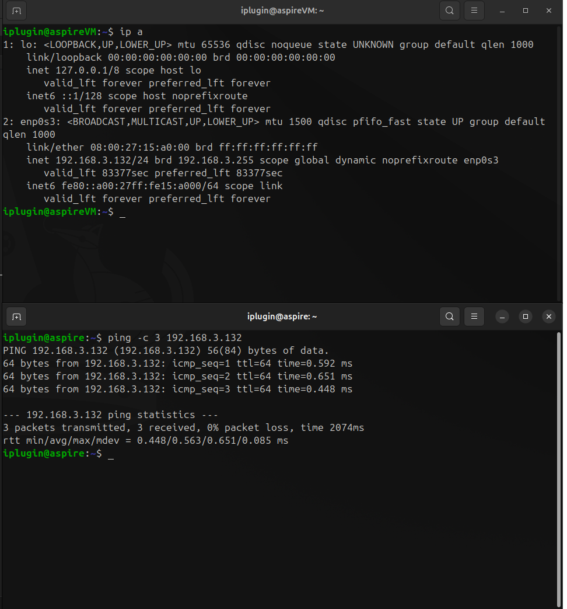
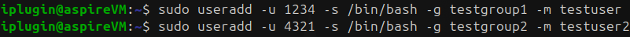
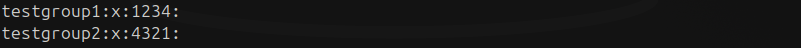
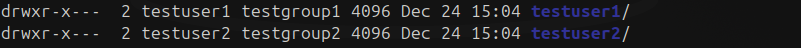

# Привіт Yanina Husarevych
Судячи з вашої відповіді "З приводу зовнішнього вигляду дз - docx/pdf/презенташка/відео - головне щоб в повному обсязі ви показали що вийшло в результаті" я прийняв рішення домашнє закидати на гіт хаб а в README.md буду його описувати і чому так а не інакше

# Description of the homework
- Ubuntu Linux installation to the Virtual Box VM, configure host-only network and organize network connection between the main PC and VM.
- Add new group “testgroup1” with GID 1234
- Add new group “testgroup2” with GID 4321
- Add new user “testuser” with UID 1234, Shell: /bin/bash, primary group = “testgroup1”, create homedir automatically.
- Add new user “testuser2” with UID 4321, Shell: /bin/bash, primary group = “testgroup2”, create homedir automatically.
- Rename “testuser” to “testuser1”
- Modify “testuser1” directory to be the same as username.

# Налаштування середовища
- Перед тим як почати роботу я завантажив VirtualBox і ISO Ubuntu 24.04.1 LTS Desktop версію
- Так як мене напрягає працювати через віртуалку встановлюю SSH на віртуальну машину за домогою команди
``` Bash VM
sudo apt install openssh-server
```

- Дальше я створюю ssh-key обмінюсь ключами
``` Bash VM
ssh-keygen -t ed25519 # створити ключ
```
``` Bash local
ssh -i <private_key> username@hostname # ssh підключення по ключу 
```

- І обмежуюю доступ тільки по ssh в файлі `/etc/ssh/sshd_config`
``` /etc/ssh/sshd_config
PermitRootLogin no
PubkeyAuthentication yes
PasswordAuthentication no
```
``` Bash VM
sudo systemctl restart ssh
```

# Виконання домашнього
- Ubuntu Linux installation to the Virtual Box VM, configure host-only network and organize network connection between the main PC and VM.


- Add new group “testgroup1” with GID 1234
``` Bash VM
sudo groupadd -g 1234 testgroup1
```

- Add new group “testgroup2” with GID 4321
``` Bash VM
sudo groupadd -g 4321 testgroup2
```


- Add new user “testuser” with UID 1234, Shell: /bin/bash, primary group = “testgroup1”, create homedir automatically.
``` Bash VM
sudo useradd -u 1234 -s /bin/bash -g testgroup1 -m testuser
```

- Add new user “testuser2” with UID 4321, Shell: /bin/bash, primary group = “testgroup2”, create homedir automatically.
``` Bash VM
sudo useradd -u 4321 -s /bin/bash -g testgroup2 -m testuser2
```



- Rename “testuser” to “testuser1”
``` Bash VM
sudo usermod -l testuser1 testuser
```

- Modify “testuser1” directory to be the same as username.
``` Bash VM
sudo mv /home/testuser /home/testuser1
sudo usermod -d /home/testuser1 testuser1
```


# Перевірка
``` Bash VM
cat /etc/passwd
```


``` Bash VM
cat /etc/group
```



``` Bash VM
ll /home
```


