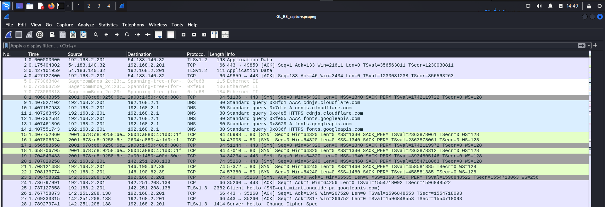
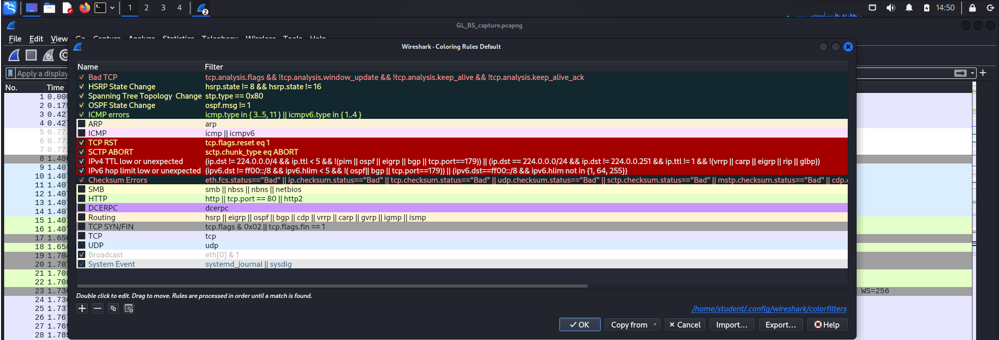
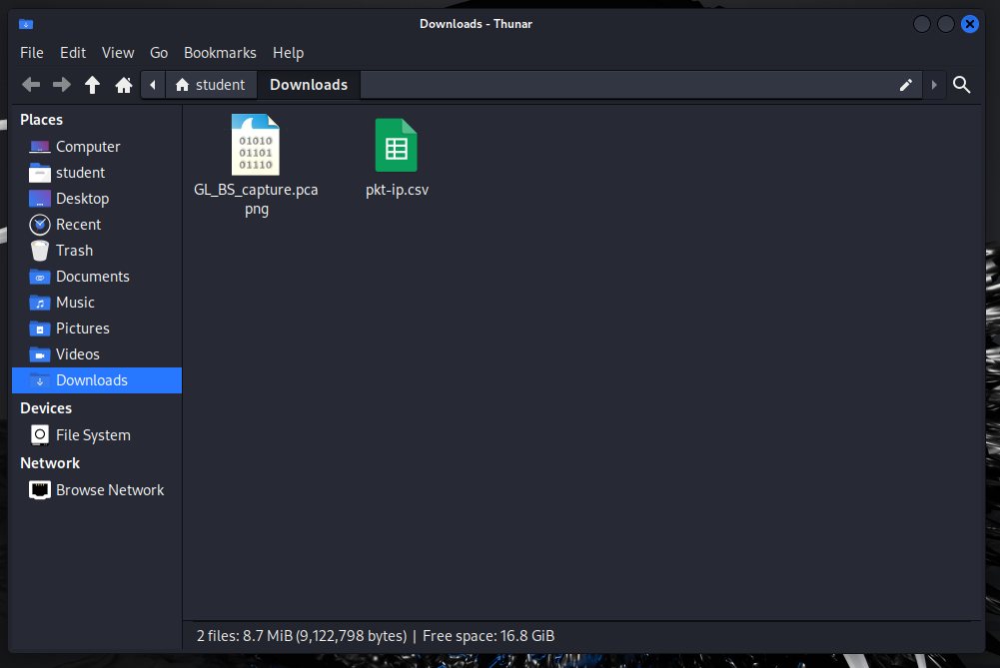
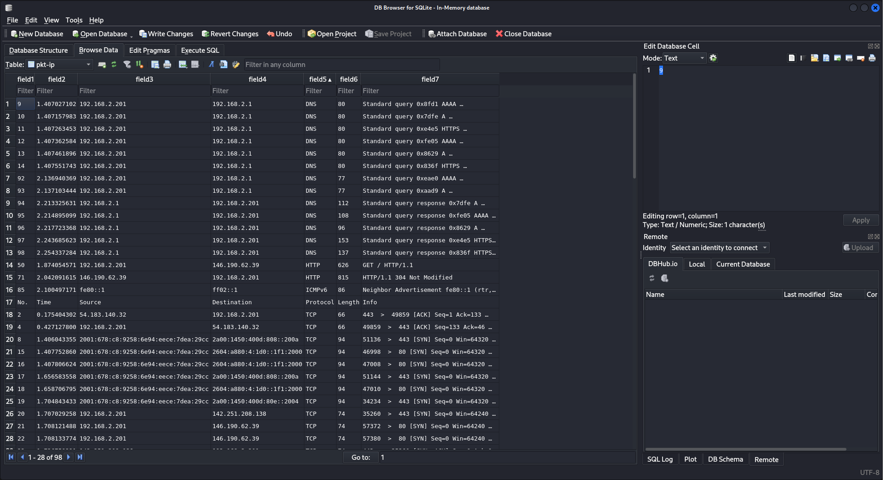
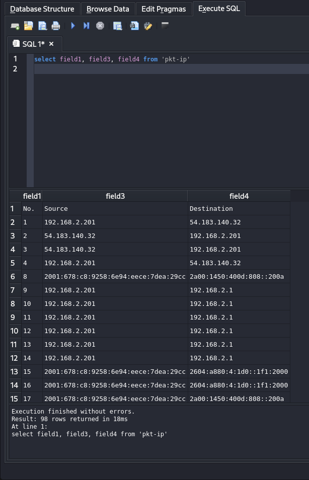
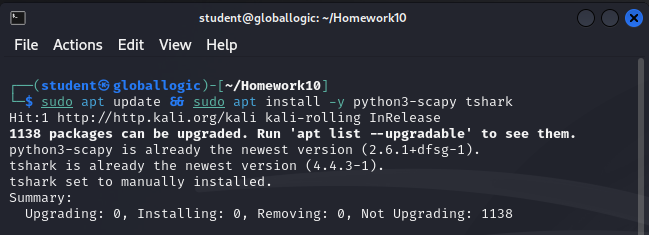
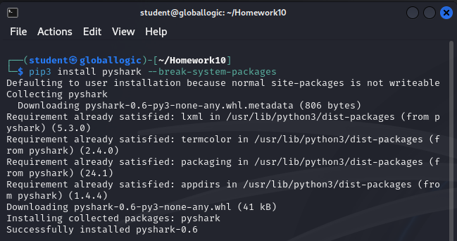
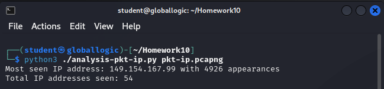
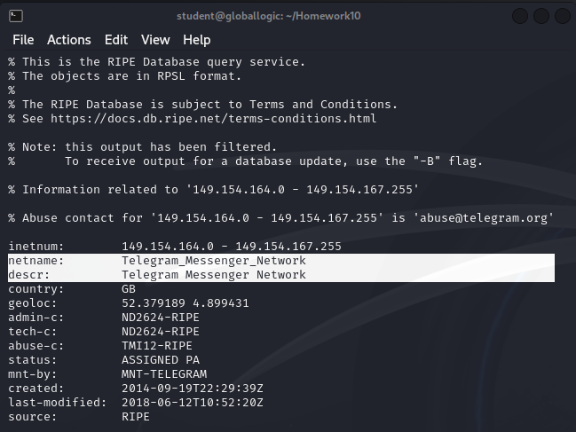
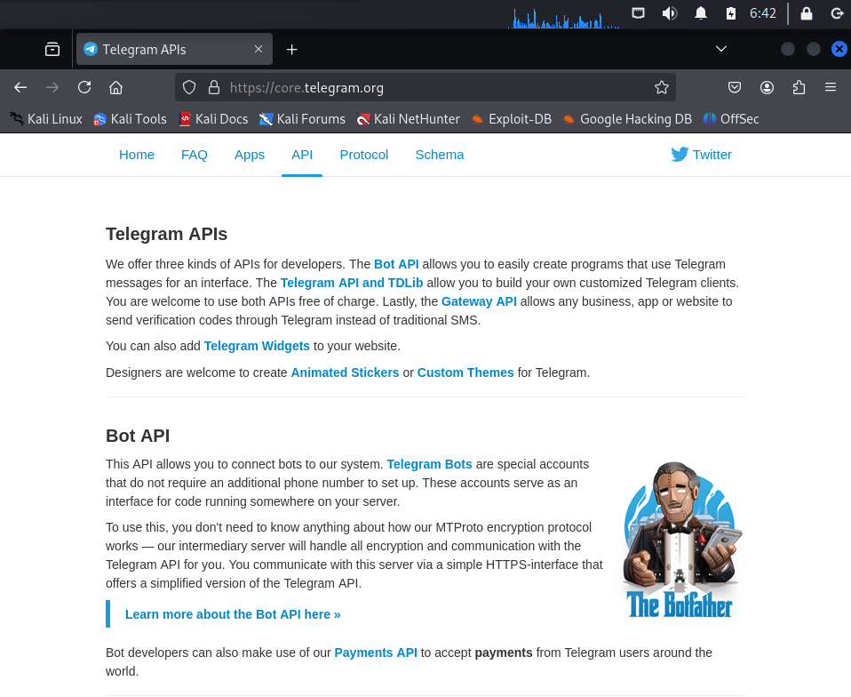

# Homework 10 | `Deadline 4 February` | [Presentation](https://github.com/iPlugin/EDUC/blob/main/os_network/pres/GlobalLogic%20Lec2%20Networking%20Basics.pdf)
## Topics in this lecture:
- Model OSI
- Network subsystem in OS
- Routing
- Traffic encapsulation
- Traffic manipulation, filtering

## Description of the homework
### You’d receive dumped packets from the real internet traffic. The dump is in hex format.
- If packet is an IP packet find source and destination addresses
- If the packet was used for TCP stream find source and destination ports
- If the packet was part of HTTP session find a web page address
- If the packet was Internet Control Message Protocol find sequence number

## Work in Progress
**Для роботи з мережами я встановлю Kali Linux на віртуальну машину і буду працювати з wireshark**
```
File -> Open -> /home/student/GL_BS_capture.pcapng
```


```
View -> Coloring Rules
```



```
Серед перших 100 пакетів знайти (IP, TCP, HTTP, ICMP) і проаналізувати їх.
wireshark: frame.number <= 100
```

### You’d receive dumped packets from the real internet traffic. The dump is in hex format.
- If packet is an IP packet find source and destination addresses

```
wireshark: frame.number <= 100 && (ip || ipv6)
```


```
File -> Save As -> `pkt-ip.pcapng`
```



**Створимо файл .py для аналізу даних (source and destination addresses). Ідею почерпнув з телеграму одного програміста [посилання](https://t.me/+Js93xt0NFmJiOWZi)**

``` Bash
# Сторив нову папку для файлів щоб воно не було в Downloads
ll
mkdir ~/Homework10/
mv ~/Downloads/* ~/Homework10
cd ~/Homework10
ll
```



``` Bash
nano analysis-pkt-ip.py
cat analysis-pkt-ip.py
```



``` Bash
sudo apt update && sudo apt install -y python3-scapy tshark
```



``` Bash
pip3 install pyshark --break-system-packages
```



``` Bash
python3 ./analysis-pkt-ip.py pkt-ip.pcapng
```



``` Bash
whois 149.154.164.99
```



**Після того як ми переконалися що це НЕ pornhub.com від лектора Андрія 😂, можемо перейти попосиланню**



**Нас зустрічає батько всіх телеграм ботів 😍, маю з ним проєкт в себе в github [посилання](https://github.com/iPlugin/PROJ/tree/main/py_aiogram_linux)**

- If the packet was used for TCP stream find source and destination ports


- If the packet was part of HTTP session find a web page address


- If the packet was Internet Control Message Protocol find sequence number


