# Homework 10 | `Deadline 4 February` | [Presentation](https://github.com/iPlugin/EDUC/blob/main/os_network/pres/GlobalLogic%20Lec2%20Networking%20Basics.pdf)
## Topics in this lecture:
- Model OSI
- Network subsystem in OS
- Routing
- Traffic encapsulation
- Traffic manipulation, filtering

## Description of the homework
### You’d receive dumped packets from the real internet traffic. The dump is in hex format.
- If packet is an IP packet find source and destination addresses
- If the packet was used for TCP stream find source and destination ports
- If the packet was part of HTTP session find a web page address
- If the packet was Internet Control Message Protocol find sequence number

## Work in Progress
**Для роботи з мережами я встановлю Kali Linux на віртуальну машину і буду працювати з wireshark**
```
File -> Open -> /home/student/GL_BS_capture.pcapng
```


```
View -> Coloring Rules
```


```
Серед перших 100 пакетів знайти (IP, TCP, HTTP, ICMP) і проаналізувати їх.
wireshark: frame.number <= 100
```

### You’d receive dumped packets from the real internet traffic. The dump is in hex format.
- If packet is an IP packet find source and destination addresses

```
wireshark: frame.number <= 100 && (ip || ipv6)
```


```
File -> Save As -> `pkt-ip.pcapng`
```


``` Bash
# Створив нову папку для файлів щоб воно не було в Downloads
ll
mkdir ~/Homework10/
mv ~/Downloads/* ~/Homework10
cd ~/Homework10
ll
```


**Створимо файл .py для аналізу даних (source and destination addresses). Ідею почерпнув з телеграму одного програміста [посилання](https://t.me/+Js93xt0NFmJiOWZi)**

``` Bash
nano analysis-pkt-ip.py
cat analysis-pkt-ip.py
```


``` Bash
# Завантажуємо залежності
sudo apt update && sudo apt install -y python3-scapy tshark
```


``` Bash
# Завантажуємо залежності 
pip3 install pyshark --break-system-packages
```


``` Bash
python3 ./analysis-pkt-ip.py pkt-ip.pcapng
```


``` Bash
whois 149.154.164.99
```


**Після того як ми переконалися що це НЕ pornhub.com від лектора Андрія 😂, можемо перейти по IP адресу**


**Нас зустрічає батько всіх телеграм ботів 😍, маю з ним проєкт в себе в [github](https://github.com/iPlugin/PROJ/tree/main/py_aiogram_linux)**

**Src addr 192.168.2.201 - Dest addr 149.154.164.99**

- If the packet was used for TCP stream find source and destination ports

```
wireshark: frame.number <= 100 && tcp
```

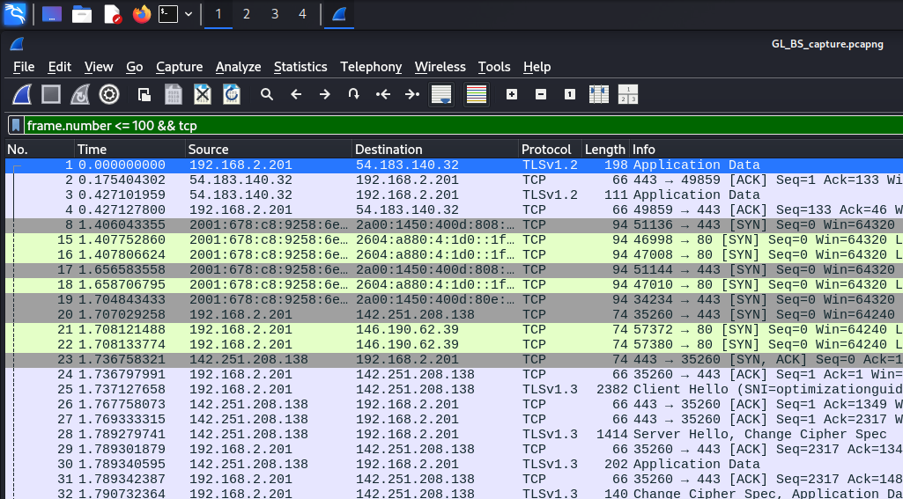

```
File -> Save As -> `pkt-tcp.pcapng`
```

**Так як TCP пакетів доволі багато я скористаюся тим що ви написали в групі: "Можете подивитись весь трафік і пошукати якісь цікаві вам пакети". Тому я оцінюю це як з перших 100 пакетів знайти TCP цікавий і описати його. Для мене цікавий пакет виявився під номером 87 так як він позначений не стандартним кольором. Якщо судити з Coloring Rules (скрін був десь зверху) то проблема в "Checksum Errors" або "Bad TCP"**

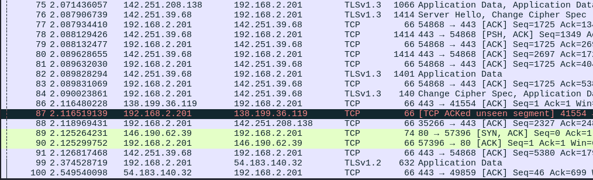

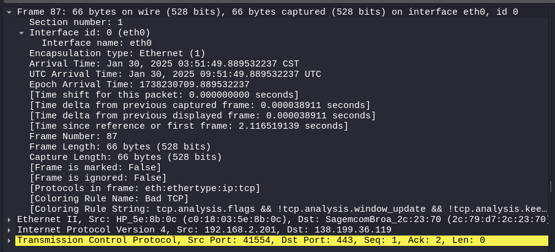

```
Довжина фрейму: 528 біт
Час прибуття: Jan 30, 2025 03:51:49 UTC
Фрейм типу: Bad TCP - проблема можливо в прапорцях або в віконному оновлені
```

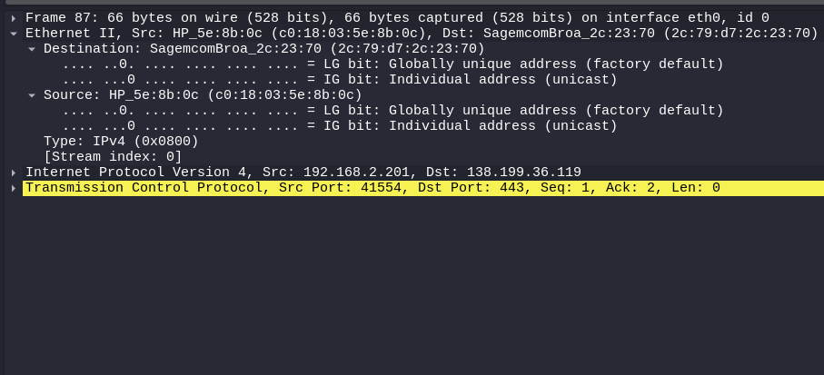

```
MAC-адреса відправника: c0:18:03:5e:8b:0c
MAC-адреса отримувача: 2c:79:d7:2c:23:70
Тип протоколу: IPv4 (0x0800)
```

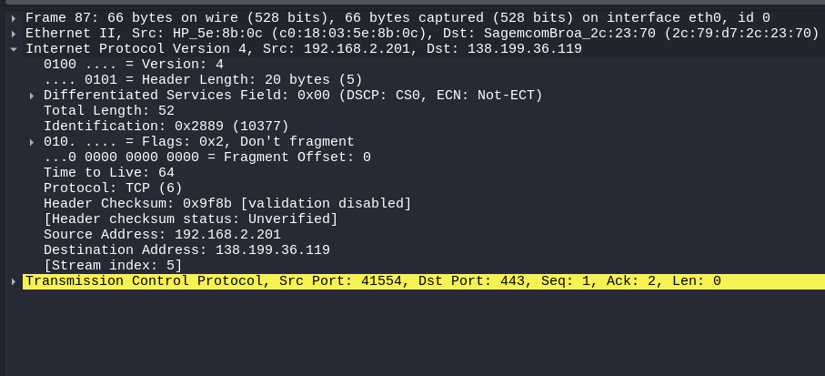

```
Адреса відправника: 192.168.2.201 - приватна ip
Адреса отримувача: 138.199.36.119 - публічна ip
Загальна довжина: 52 байти
Прапорцець: Don't Fragment
Час на життя: 64
Протокол: TCP (6)
```


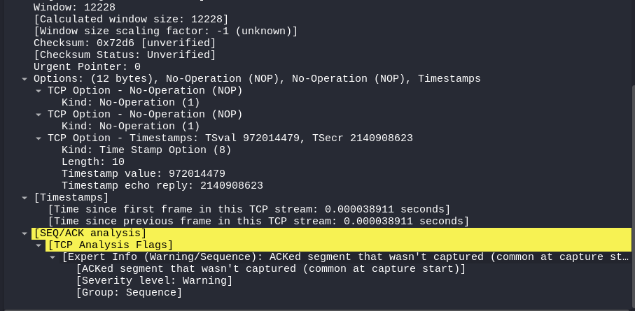

```
Порт відправника: 41554 - порт згенерований ОС
Порт отримувача: 443 - порт HTTPS
Номер послідовності: 1
Номер підтвердження: 2
Корисного навантаження: 0
Прапорець TCP: ACK
```

**Я прийшов висновку що або пакет реально було втрачено або Wireshark не встиг захопити**

**Src port 41554 - Dest port 443**

- If the packet was part of HTTP session find a web page address

```
wireshark: frame.number <= 100 && http
```

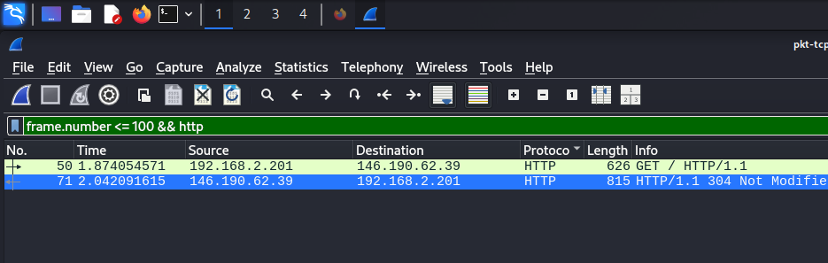
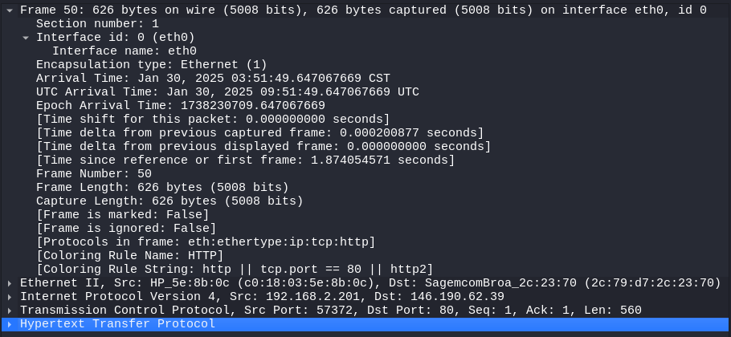

```
Довжина фрейму: 5008 біт
Час прибуття: Jan 30, 2025 03:51:49 UTC
```

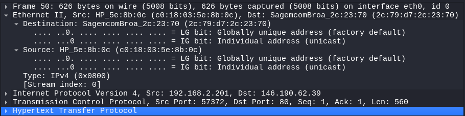

```
MAC-адреса відправника: c0:18:03:5e:8b:0c
MAC-адреса отримувача: 2c:79:d7:2c:23:70
Тип протоколу: IPv4 (0x0800)
```

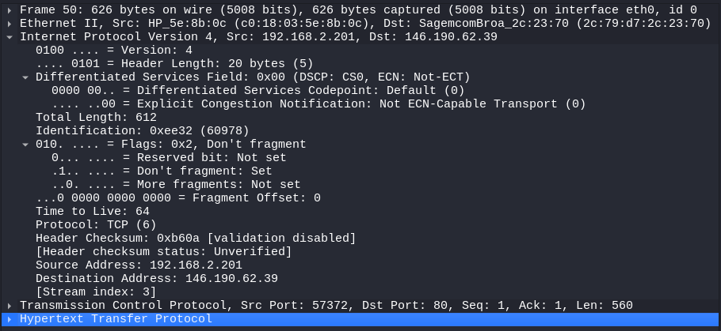

```
Адреса відправника: 192.168.2.201 - приватна ip
Адреса отримувача: 146.190.62.39 - публічна ip якогось вебсерверу
Загальна довжина: 612 байти
Прапорцець: Don't Fragment
Час на життя: 64
Протокол: TCP (6)
```

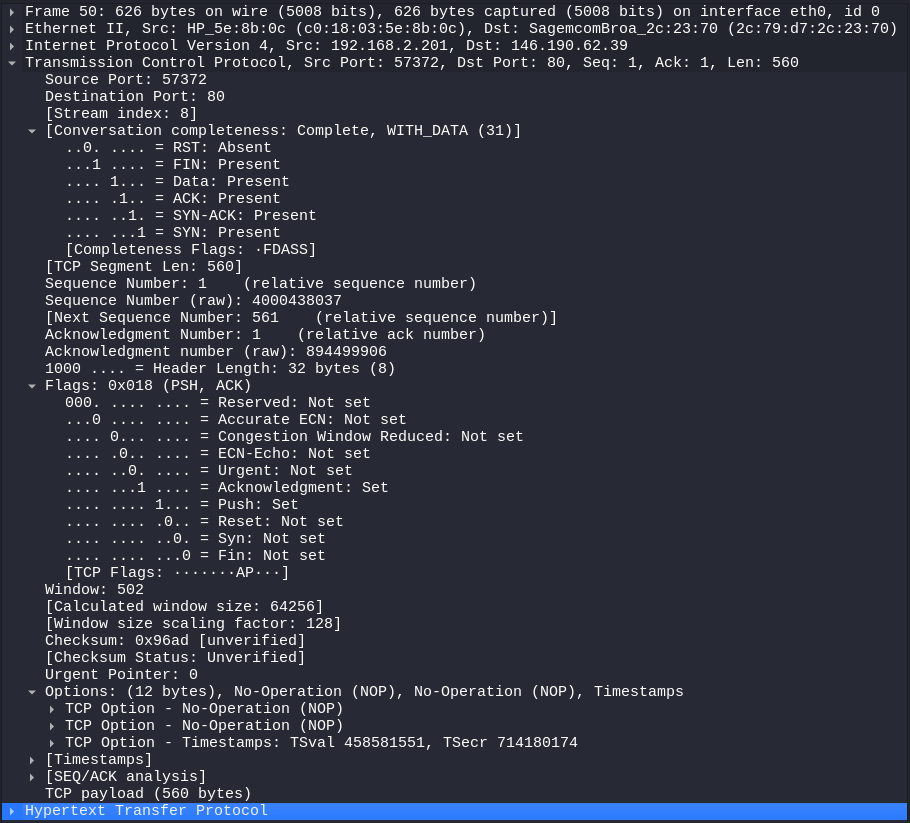

```
Порт відправника: 57372 - порт згенерований ОС
Порт отримувача: 80 - порт HTTP
Номер послідовності: 1
Номер підтвердження: 561
Корисного навантаження: 560
Прапорець TCP: ACK, PSH
```

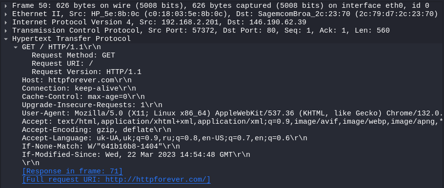

```
Хост: httpforever.com
Підключення: keep-alive
Upgrade-Insecure-Requests: 1 - не знав про таке, але тепер знаю. Просить перейти на https, якщо це можливо
User-Agent: Mozilla, Linux
Accept: text/html,application/xhtml+xml... - перелік форматів, які клієнт може обробити
Accept-Encoding: gzip - стиснення файлів в цей формат
Accept-Language: uk-UA - мова інтерфейсу 
```

**Фрейм 71 відповідь на запит 50 фрейм**

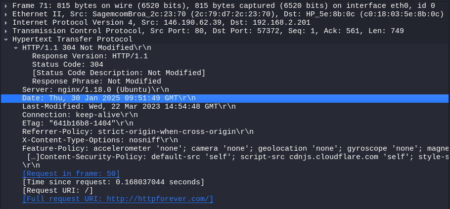

**Web page address (146.190.62.39) httpforever.com**


- If the packet was Internet Control Message Protocol find sequence number

```
wireshark: frame.number <= 100 && (icmp || icmpv6)
```

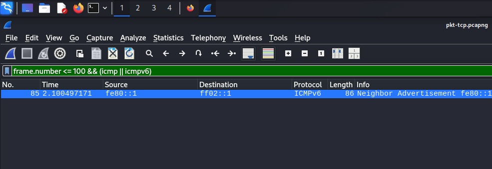


```
Довжина фрейму: 688 біт
Час прибуття: Jan 30, 2025 03:51:49 UTC
```

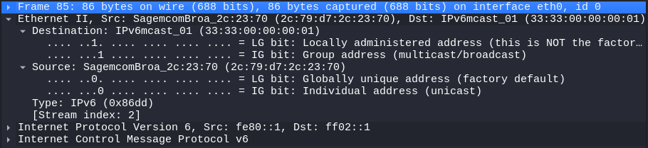

```
MAC-адреса відправника: 2c:79:d7:2c:23:70
MAC-адреса отримувача: 33:33:00:00:00:01
Тип протоколу: IPv6 (0x86dd)
```

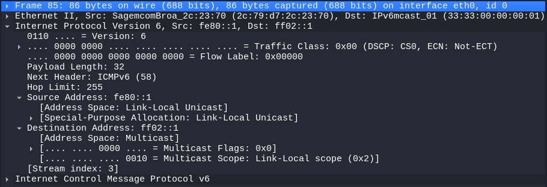

```
Адреса відправника: fe80::1
Адреса отримувача: ff02::1
Traffic Class: 0x00 (DSCP: CS0, ECN: Not-ECT)
Hop Limit: 255 
```

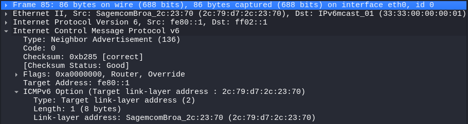

```
Тип повідомлення: 136 - Neighbor Advertisement
Код: 0
Контрольна сума: 0xb285
Прапорці: Router, Override
```

**В ICMP нема "sequence number" його використовують в TCP**