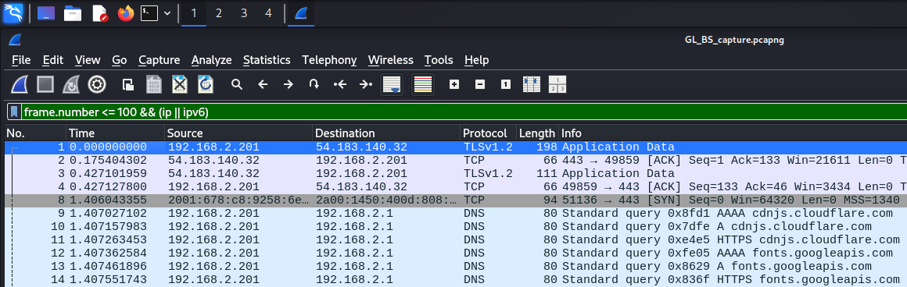
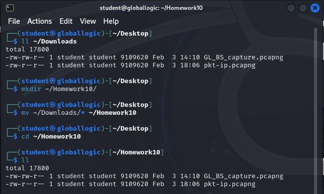

# Homework 10 | `Deadline 4 February` | [Presentation](https://github.com/iPlugin/EDUC/blob/main/os_network/pres/GlobalLogic%20Lec2%20Networking%20Basics.pdf)
## Topics in this lecture:
- Model OSI
- Network subsystem in OS
- Routing
- Traffic encapsulation
- Traffic manipulation, filtering

## Description of the homework
### You’d receive dumped packets from the real internet traffic. The dump is in hex format.
- If packet is an IP packet find source and destination addresses
- If the packet was used for TCP stream find source and destination ports
- If the packet was part of HTTP session find a web page address
- If the packet was Internet Control Message Protocol find sequence number

## Work in Progress
**Для роботи з мережами я встановлю Kali Linux на віртуальну машину і буду працювати з wireshark**
```
File -> Open -> /home/student/GL_BS_capture.pcapng
```


```
View -> Coloring Rules
```


```
Серед перших 100 пакетів знайти (IP, TCP, HTTP, ICMP) і проаналізувати їх.
wireshark: frame.number <= 100
```

### You’d receive dumped packets from the real internet traffic. The dump is in hex format.
- If packet is an IP packet find source and destination addresses
```
wireshark: (ip || ipv6) && frame.number <= 100
Такккк мені відкинуло тільки 3 пакети з 100 це погано, так як переписувати 97 пакетів 'source and destination addresses' це дуже багато часу займе 
```


```
Тому я вирішив зберегти 97 пакетів в окремий файлю.csv
File -> Export Packet Dissections -> As CSV
```


```
Так як на Kali нема Editora який зможе відкривати файли .csv, мені пропонує DB Browser for SQLite
```



```
Тому я вирішив SQL командою відфільтрувати номер | джерело | призначення
SQLite: select field1, field3, field4 from 'pkt-ip'
```


- If the packet was used for TCP stream find source and destination ports


- If the packet was part of HTTP session find a web page address


- If the packet was Internet Control Message Protocol find sequence number


