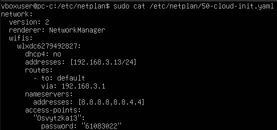
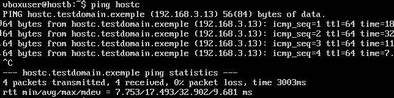
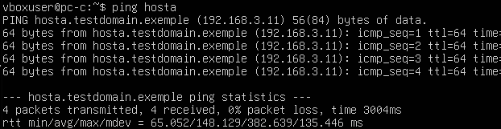

# Homework 11 | `Deadline 5 February` | [Presentation](https://github.com/iPlugin/EDUC/blob/main/os_network/pres/GlobalLogic%20Lec3%20Networking%20Tools.pdf)
## Topics in this lecture:
- Configuration of the operating system:
    - hostname
    - ifconfig / iproute2
    - route / iproute2
    - netstat
    - dhcp
- Debugging OS configuration:
    - ping
    - traceroute / mtr
    - host
    - dig
- System network services:
    - ifup
    - connman
    - netplan
    - NetworkManager

## Description of the homework
- There are 3 computers in the physical network: A, B, C. There is a dedicated IP addresses range that can be used 10.10.10.0 up to 10.10.10.255. Please explain a network configuration that need to be done in order to achieve following results:
    - Computer A can directly communicate to B
    - Computer B can directly communicate with C
    - Computer A can not communicate directly with C
    - Each computer shall have a hostname and FQDN (hosta, hostb, hostc and domain name can be testdomain.exemple)
    - Every computer shall be able to resolve both hostname and FQDN into proper IP address
- Please provide all required commands to configure all three computers

## Work in Progress
**Як я зрозумів з опису завдання треба УЯВИТИ що тебе є 3 компютера і просто накидати команди для кофігурації кожного з них. Я вирішив що уявляти не буду, а встановлю 3 віртуальні машини Ubuntu Server. Чому Ubuntu Server? Тому що вона найменше займає памяті, швидше встановиться і процесорів менше треба виділяти і тому ноутбук менше буде нагріватися**

- There are 3 computers in the physical network: A, B, C. There is a dedicated IP addresses range that can be used 10.10.10.0 up to 10.10.10.255. Please explain a network configuration that need to be done in order to achieve following results:

**IP вигляду 10.10.10.Х я не добюсь, так як треба буде DHCP маршрутизатора міняти, тому використаю 192.168.3.[11-13]**


**Піключення до WiFi всіх одинаковий тому покажу тільки на одному pc**

``` Bash
sudo apt install network-manager
```


``` Bash
nmcli device wifi list
```


``` Bash
nmcli device status
```


``` Bash
nmcli device wifi connect "Osvytzka13" password "61083022"
```


``` Bash
nmcli device status
```


``` Bash
ip a # pc-a: 192.168.3.147
```


``` Bash
ip a # pc-b: 192.168.3.99
```


``` Bash
ip a # pc-c: 192.168.3.148
```


**Тепер задам ip адреси в межах 192.168.3.[11-13]**

``` Bash
# pc-a
cd /etc/netplan/
```


``` Bash
# pc-a
ll
```


``` Bash
# pc-a
sudo nano 50-cloud-init.yaml
sudo cat 50-cloud-init.yaml
```


``` Bash
# pc-a
sudo netplan try
```


``` Bash
# pc-a
sudo netplan apply
```


``` Bash
# pc-a
ip a # 192.168.3.11
```


``` Bash
# pc-b
cd /etc/netplan/
```


``` Bash
# pc-b
ll
```


``` Bash
# pc-b
sudo nano 50-cloud-init.yaml
sudo cat 50-cloud-init.yaml
```


``` Bash
# pc-b
sudo netplan try
```


``` Bash
# pc-b
sudo netplan apply
```


``` Bash
# pc-b
ip a # 192.168.3.12
```


``` Bash
# pc-с
cd /etc/netplan/
```


``` Bash
# pc-с
ll
```


``` Bash
# pc-с
sudo nano 50-cloud-init.yaml
sudo cat 50-cloud-init.yaml
```



``` Bash
# pc-с
sudo netplan try
```


``` Bash
# pc-с
sudo netplan apply
```


``` Bash
# pc-с
ip a # 192.168.3.13
```


- Each computer shall have a hostname and FQDN (hosta, hostb, hostc and domain name can be testdomain.exemple)

``` Bash
# pc-a
hostname
```


``` Bash
# pc-a
sudo hostnamectl set-hostname hosta
```


``` Bash
# pc-a
hostname
```


``` Bash
# pc-a
sudo nano /etc/hosts
sudo cat /etc/hosts
```


``` Bash
# pc-a
hostname
hostname -f
```


``` Bash
# pc-b
hostname
```


``` Bash
# pc-b
sudo hostnamectl set-hostname hostb
```


``` Bash
# pc-b
hostname
```


``` Bash
# pc-b
sudo nano /etc/hosts
sudo cat /etc/hosts
```


``` Bash
# pc-b
hostname
hostname -f
```


``` Bash
# pc-c
hostname
```


``` Bash
# pc-c
sudo hostnamectl set-hostname hostс
```


``` Bash
# pc-c
hostname
```


``` Bash
# pc-c
sudo nano /etc/hosts
sudo cat /etc/hosts
```


``` Bash
# pc-c
hostname
hostname -f
```


- Every computer shall be able to resolve both hostname and FQDN into proper IP address

``` Bash
# pc-a -> pc-b
ping hostb
```


``` Bash
# pc-a -> pc-b
ping hostb.testdomain.exemple
```


``` Bash
# pc-b -> pc-c
ping hostc
```



``` Bash
# pc-b -> pc-c
ping hostc.testdomain.exemple
```


``` Bash
# pc-c -> pc-a
ping hosta
```



``` Bash
# pc-c -> pc-a
ping hosta.testdomain.exemple
```


- Computer A can directly communicate to B

``` Bash
# pc-a -> pc-b
ping 192.168.3.12
```


- Computer B can directly communicate with C

``` Bash
# pc-b -> pc-c
ping 192.168.3.13
```


- Computer A can not communicate directly with C

``` Bash
ping 192.168.3.13 # connect to hostc
sudo iptables -A OUTPUT -d 192.168.3.13 -j DROP
ping 192.168.3.13 # connect to hostc again
# Використав 3 команди в одному скріні щоб максимально показати різницю до і після
# Вам для зручності відокремив їх червоними лініями
```


