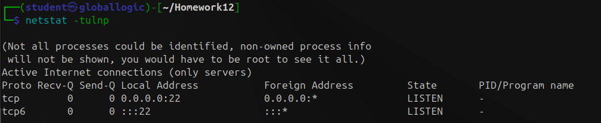
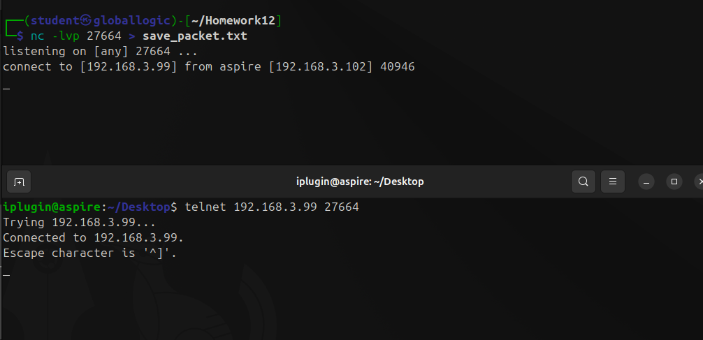

# Homework 12 | `Deadline 11 February` | [Presentation](https://github.com/iPlugin/EDUC/blob/main/os_network/pres/GlobalLogic%20Lec4%20Typical%20Stacks.pdf)
## Topics in this lecture:
- Streaming protocols TCP/IP
- Datagram protocols UDP/IP
- Network diagnostic using tools

## Description of the homework
- Use netcat command start server which is listening on a TCP port 27664
    - Whatever netcat will receive as a server should be written/dumped into a file
- Using a telnet command connect to that TCP server (port 27664) and send some example message
- While doing so, capture all the traffic using wireshark
    - Investigate and apply necessary filter expression to filter
- Create a redirect rule which would redirect incoming traffic to port 21 to our server on port 27664. Demonstrate how telnet successfully connecting to the port 21 and reaching our server instead

## Work in Progress

``` Bash
# Kali 192.168.3.99
mkdir Homework12
cd Homework12
```


``` Bash
# Kali 192.168.3.99
netstat -tulnp
```



**Запускаємо Wireshark з правами адміністратора і обираємо інтерфейс "any"**

``` Bash
# Kali 192.168.3.99
nc -lvp 27664 > save_packet.txt
```


``` Bash
# Ununtu 192.168.3.102
telnet 192.168.3.99 27664
```



``` Text mesg
# Ununtu 192.168.3.102
# Відправляємо повідомлення
Hello world!
GlobalLogic task 12
# Виходимо ctrl + ] -> quit -> enter
```


``` Bash
# Kali 192.168.3.99
sudo iptables -t nat -A PREROUTING -p tcp --dport 21 -j REDIRECT --to-port 27664
```


``` Bash
# Kali 192.168.3.99
sudo iptables -t nat -L -v -n
```


``` Bash
# Kali 192.168.3.99
nc -lvp 27664 >> save_packet.txt
```


``` Bash
# Ununtu 192.168.3.102
telnet 192.168.3.99 21
```


``` Text mesg
# Ununtu 192.168.3.102
# Відправляємо повідомлення
Hello Yanina!
How are you?
# Виходимо ctrl + ] -> quit -> enter
```


``` Bash
# Kali 192.168.3.99
cat save_packet.txt
```


**Відключаємо Wireshark і переглядаємо трафік**


``` Wireshark
# Save As -> network_traffic.pcap
```


``` Wireshark
wireshark: ip.addr == 192.168.3.99 || ip.addr == 192.168.3.102
```


**Так як я був підключений до Kali через SSH тому відфільтруємо ще без нього**

``` Wireshark
wireshark: (ip.addr == 192.168.3.99 || ip.addr == 192.168.3.102) && !tcp.port == 22
```


**Все ще багато... тому фільтруємо ще по payload**

``` Wireshark
wireshark: (ip.addr == 192.168.3.99 || ip.addr == 192.168.3.102) && !tcp.port == 22 && data.len > 0
```


**489**


**492**


**Є якісь дані але в шістнадцятковому представлені**

``` Bash
echo "48 65 6c 6c 6f 20 77 6f 72 6c 64 21 0d 0a" | xxd -r -p
```


``` Bash
echo "47 6c 6f 62 61 6c 4c 6f 67 69 63 20 74 61 73 6b 20 31 32 0d 0a" | xxd -r -p
```


**Окей це все круто. Але де інші 2 повідомлення? Відкатуємося один фільтр назад. І бачимо два підозрілі FTP пакати серед всіх TCP**


**2027**


**2030**


**І ось наші дані. А чому вони тоді FTP? Тому що ці дані відправлялися на 21 порт, а це порт FTP, а вже пізніше iptables перенаправляв на 27664**