# Homework 13 | `Deadline 12 February` | Domain name system
## Topics in this lecture:
- Concept of name resolution 
- Tools: host, nslookup, delv, whois

## Description of the homework
- Do and write down step-by-step recursive query for a selected domain name using preferred utility. Note all significant records on your way to the A record.
- Install and configure dnsmasq as a caching DNS Server
- Perform DNS resolution requests (For instance:$ nslookup globallogic.com)
- Capture IP trace using tcpdump of DNS requests

## Work in Progress
- Do and write down step-by-step recursive query for a selected domain name using preferred utility. Note all significant records on your way to the A record.
``` Bash
# Отримати NS записів для .com
dig @f.root-servers.net com NS
```

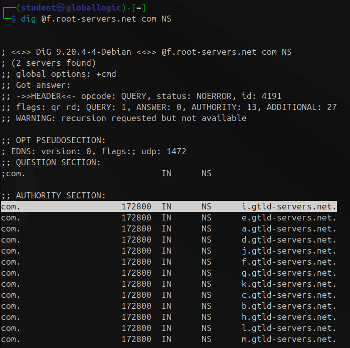

``` Bash
# Отримати NS записів для google.com
dig @i.gtld-servers.net google.com NS
```

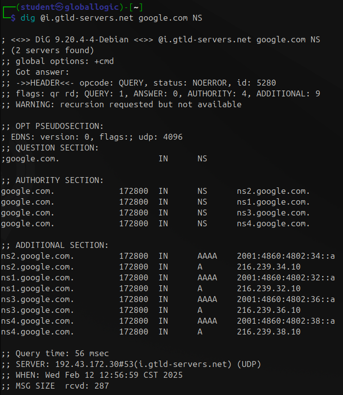

``` Bash
# Отримати А запису для google.com
dig @ns1.google.com google.com A
```

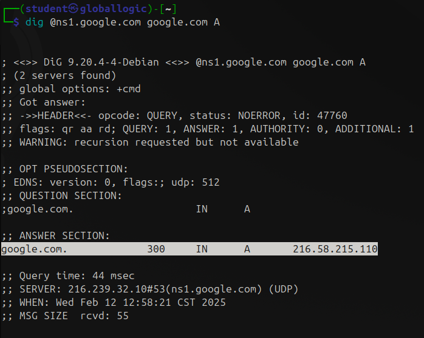

- Install and configure dnsmasq as a caching DNS Server

``` Bash
sudo apt install dnsmasq
```

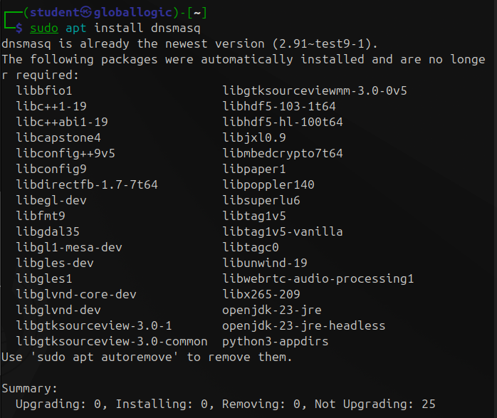

``` Bash
dnsmasq --version
```

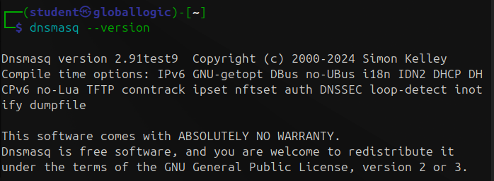

``` Bash
sudo nano /etc/dnsmasq.conf
```

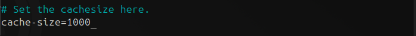

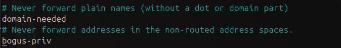

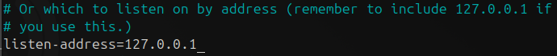

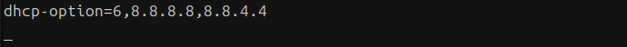

```
cache-size=1000
domain-needed 
bogus-priv
listen-address=127.0.0.1
dhcp-option=6,8.8.8.8,8.8.4.4
```

``` Bash
sudo systemctl restart dnsmasq
sudo systemctl status dnsmasq
```

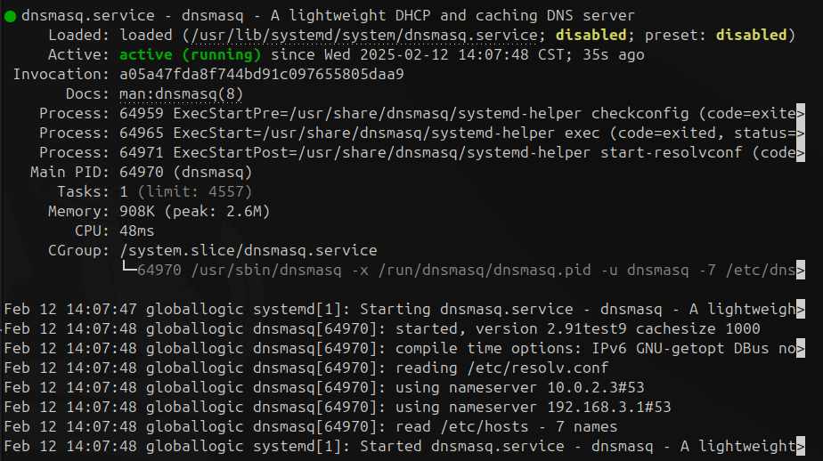

- Perform DNS resolution requests (For instance:$ nslookup globallogic.com)

``` Bash
nslookup globallogic.com
```

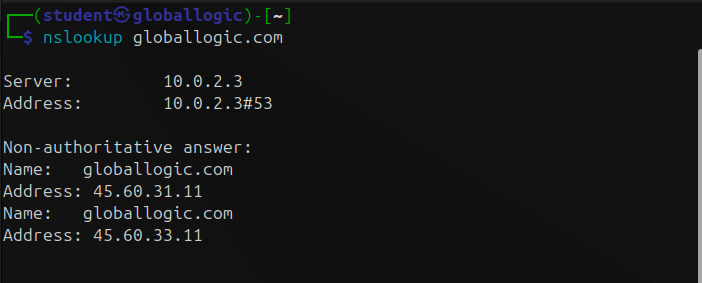

- Capture IP trace using tcpdump of DNS requests

``` Bash
sudo tcpdump -i any -n port 53
```

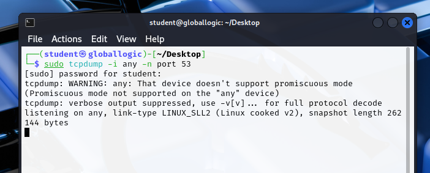

``` Bash
nslookup globallogic.com 127.0.0.1
```

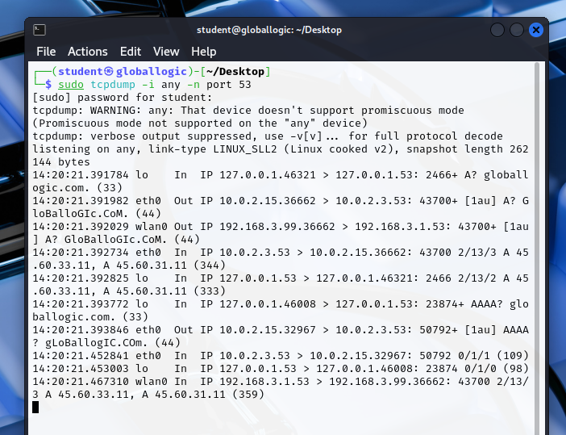

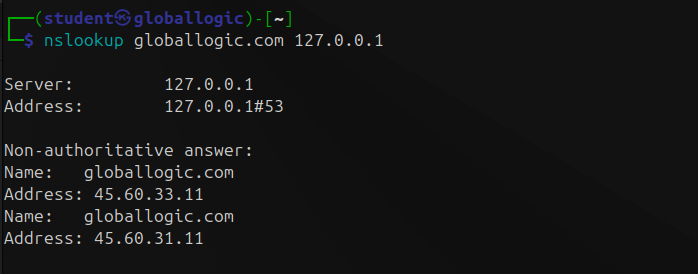