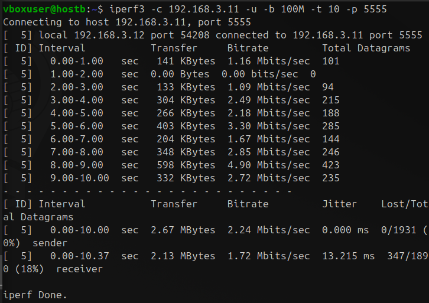

# Homework 14 | `Deadline 18 February` | Debugging network applications
## Topics in this lecture:
- Basic tools: nettop / iftop, dstat
- Connectivity tools and scanners: telnet, netcat (nc), nmap
- Network data monitoring and debugging applications: tcpdump, iptraf (iptraf-ng), trafshow
- Network performance (ttcp)

## Description of the homework
### Compile, install and run nettop utility.
The goal of this task - install 3rd party network utility to the Ubuntu host and run it. Needed installation steps are described in the lecture nettop section.

### Generate a table (google or excel) with the IP addresses taking up the most network traffic within the 30sec time frame in the following format: src IP|src port|dst IP|dst port|protocol|total bytes.
Use network interface with global network(internet) access.

### Create a cron job which will gather traffic load on the public internet network interface:
- Job must be executed each day every hour in a  5min steps of each hour (e.g. 10:05, 10:15, 10:25, …. 11:35, 11:45… 12:15…, e.t.c.)
- Job must gather networking traffic for a 10sec and record the results to some file on the filesystem for the later analysis.
- Job must capture the number of bytes transferred

### Create another cron job which will run each hour at the beginning of the hour and do previously captured data analysis:
- Job must find out the most networking consuming connection
- Job must print he most networking consuming connection to the syslog
- Job must clear the results file of the previous job.

### Transferring files over the network using netcat(nc)
Create a compressed archive using tar + bzip2 on the host A and send it to host B over the network. As a data for archive current user’s home directory may be used. NOTE: Same Host may be used for this task.

### Nmap Security scanning self-education  task
The goal of the task - find out and run certain type of scans for obtaining extended system/services information, get the results and analyze them.
- Detect service/daemon versions using nmap (-sV parameter)
- Perform an OS and service detection (-A -T4 parameters)
**NOTE:** All scanning results must be saved to file for the further review and analysis. localhost can be used as a target host.

### “Nmap Scripting Engine” (NSE) self-education homework task. The goal of the task - find out and run certain type of NSE scans for obtaining extended system/services information, get the results and analyze them.
- Investigate Nmap script categories - find out information about available nmap script categories.
- Perform CVE detection using Nmap
- Perform malware and backdoors detection scanning
**NOTE:** All scanning results must be saved to file for the further review and analysis. localhost can be used as a target host.

### Investigate DHCP requests using tcpdump
- Run capturing network traffic on public interface via tcpdump using verbose mode.
- Filter only ports 67 and 68.
- Request IP address via DHCP client using the following command: #dhclient -nw eth0 (NOTE: eth0 must be replaced with the proper interface instance)
- Investigate captured data: Provide the following parameters from the DHCP session:
Client-Ethernet-Address, Requested-IP Option 50, Hostname Option 12, SRC IP/DST IP Addresses for the initial Request Message, SRC IP/DST IP Addresses for the ACK Reply Message.

### Investigate DHCP requests using wireshark
- Perform the same steps from the Task #7, but capture data to dhcp.cap using tcpdump app.
- Open dhcp.cap with wireshark
- Analyze captured data in wireshark
- Find-out the same DHCP Session fields mentioned in the Task #7.
- Capture wireshark screenshots

### Iperf task
- Measure bandwidth between the VM ubuntu and the Host PC using Host Only network and both UDP and TCP protocols.
- Capture throughput data
**NOTE:** AS an option - throughput can be measured between the 2x Ubuntu VMs.

## Work in Progress

``` Bash
mkdir Homework14/ && cd Homework14/
```


``` Bash
ip a
```


### Compile, install and run nettop utility.
The goal of this task - install 3rd party network utility to the Ubuntu host and run it. Needed installation steps are described in the lecture nettop section.

``` Bash
git clone https://github.com/Emanem/nettop.git
```


``` Bash
sudo apt-get install libncurses5-dev libncursesw5-dev build-essential libpcap-dev
```


``` Bash
cd nettop/ 
make # це вже другий раз я компілюю проєкт тому відповідь 'make: 'nettop' is up to date'
```


``` Bash
ll
```


``` Bash
sudo ./nettop
```


### Generate a table (google or excel) with the IP addresses taking up the most network traffic within the 30sec time frame in the following format: src IP|src port|dst IP|dst port|protocol|total bytes.
Use network interface with global network(internet) access.

``` Bash
sudo apt install jnettop -y
```


``` Bash
jnettop --version
```


``` Bash
sudo jnettop -i wlp0s20f3 --display text -t 30 --format '$src$,$srcport$,$dst$,$dstport$,$proto$,$totalbytes$' > tmp_traffic_30sec.csv 2>/dev/null
```


``` Bash
# Я зроблю малий скрін хоча там багато пакетів
cat tmp_traffic_30sec.csv
```


``` Bash
# Добавляю заголовки для excel таблиці
sed -i '1isrc,srcport,dst,dstport,proto,totalbytes' tmp_traffic_30sec.csv
```


``` Bash
sudo apt install csvkit
```


``` Bash
csvcut tmp_traffic_30sec.csv | csvlook
```


``` Bash
# Тут я командою записую топ 5 найбільших фреймів в мережі
awk -F',' '{print $6, $0}' tmp_traffic_30sec.csv | sort -nr | head -n 5 | cut -d' ' -f2- > tmp_top5_traffic_30sec.csv
```


``` Bash
cat tmp_top5_traffic_30sec.csv
```


``` Bash
sed -i '1isrc,srcport,dst,dstport,proto,totalbytes' tmp_top5_traffic_30sec.csv
```


``` Bash
csvcut tmp_top5_traffic_30sec.csv | csvlook
```


### Create a cron job which will gather traffic load on the public internet network interface:
- Job must be executed each day every hour in a  5min steps of each hour (e.g. 10:05, 10:15, 10:25, …. 11:35, 11:45… 12:15…, e.t.c.)
- Job must gather networking traffic for a 10sec and record the results to some file on the filesystem for the later analysis.
- Job must capture the number of bytes transferred

``` Bash
nano check_traffic.sh
```


``` Bash
chmod +x check_traffic.sh
```


``` Bash
ll
```


``` Bash
./check_traffic.sh
```


``` Bash
sudo su
crontab -l
```


``` Bash
# https://crontab.cronhub.io/
crontab -e
crontab -l
```


### Create another cron job which will run each hour at the beginning of the hour and do previously captured data analysis:
- Job must find out the most networking consuming connection
- Job must print he most networking consuming connection to the syslog
- Job must clear the results file of the previous job.

``` Bash
# Тут зміни поки так щоб я міг показати як воно в терміналі буде відображатися
nano analyze_traffic.sh
```


``` Bash
chmod +x analyze_traffic.sh
```


``` Bash
ll
```


``` Bash
./analyze_traffic.sh
```


``` Bash
nano analyze_traffic.sh
```


``` Bash
sudo su
crontab -l
```


``` Bash
crontab -e
crontab -l
```


``` Bash
cat /var/log/system_traffic.log
```


``` Bash
sudo journalctl -g "The most networking consuming connection:"
```


### Transferring files over the network using netcat(nc)
Create a compressed archive using tar + bzip2 on the host A and send it to host B over the network. As a data for archive current user’s home directory may be used. NOTE: Same Host may be used for this task.

``` Bash
# Ubuntu 192.168.3.102
sudo netstat -tuln | grep 12345
```


``` Bash
# Kali 192.168.3.99
sudo netstat -tuln | grep 12345
```


``` Bash
# Ubuntu 192.168.3.102
ping 192.168.3.99 -c 4
```


``` Bash
# Kali 192.168.3.99
ping 192.168.3.102 -c 4
```


``` Bash
# Kali 192.168.3.99
tar -cvjf home_backup.tar.bz2 ~/
```


``` Bash
# Kali 192.168.3.99
ll
```


``` Bash
# Kali 192.168.3.99
nc -lvp 4444 -q 1 < /home/student/backup_kali.tar.bz2
```


``` Bash
# Ubuntu 192.168.3.102
nc 192.168.3.99 4444 > backup_kali.tar.bz
# CTRL + Z
ll
```


``` Bash
# Ubuntu 192.168.3.102
tar -tvjf backup_kali.tar.bz
```


**Вивів вміст без самого розпакування. І можна побачити Homework10**


### Nmap Security scanning self-education  task
The goal of the task - find out and run certain type of scans for obtaining extended system/services information, get the results and analyze them.
- Detect service/daemon versions using nmap (-sV parameter)
- Perform an OS and service detection (-A -T4 parameters)
**NOTE:** All scanning results must be saved to file for the further review and analysis. localhost can be used as a target host.

``` Bash
nmap --version
```


``` Bash
sudo nmap -sV localhost -oN nmap_service_versions.txt
```


``` Bash
sudo nmap -A -T4 localhost -oN nmap_os_services_detection.txt
```


### “Nmap Scripting Engine” (NSE) self-education homework task. The goal of the task - find out and run certain type of NSE scans for obtaining extended system/services information, get the results and analyze them.
- Investigate Nmap script categories - find out information about available nmap script categories.
- Perform CVE detection using Nmap
- Perform malware and backdoors detection scanning
**NOTE:** All scanning results must be saved to file for the further review and analysis. localhost can be used as a target host.

``` Bash
sudo nmap -sV --script vuln localhost -oN cve_scan_results.txt
```


``` Bash
sudo nmap -sV --script malware localhost -oN malware_scan_results.txt
```


``` Bash
sudo nmap -sV --script backdoor localhost -oN backdoor_scan_results.txt
```


### Investigate DHCP requests using tcpdump
- Run capturing network traffic on public interface via tcpdump using verbose mode.
- Filter only ports 67 and 68.
- Request IP address via DHCP client using the following command: #dhclient -nw eth0 (NOTE: eth0 must be replaced with the proper interface instance)
- Investigate captured data: Provide the following parameters from the DHCP session:
Client-Ethernet-Address, Requested-IP Option 50, Hostname Option 12, SRC IP/DST IP Addresses for the initial Request Message, SRC IP/DST IP Addresses for the ACK Reply Message.

``` Bash
# Ubuntu wlp0s20f3: 192.168.3.102
sudo apt install isc-dhcp-client
```


``` Bash
# Kali wlan0: wlan0:
sudo tcpdump -i wlan0 -vv port 67 or port 68
```


``` Bash
# Ubuntu wlp0s20f3: 192.168.3.102
sudo dhclient -nw wlp0s20f3
```


**Реакіція Kali**


### Investigate DHCP requests using wireshark
- Perform the same steps from the Task #7, but capture data to dhcp.cap using tcpdump app.
- Open dhcp.cap with wireshark
- Analyze captured data in wireshark
- Find-out the same DHCP Session fields mentioned in the Task #7.
- Capture wireshark screenshots

``` Bash
# Kali wlan0: wlan0:
sudo tcpdump -i wlan0 -vv port 67 or port 68
```


``` Bash
# Ubuntu wlp0s20f3: 192.168.3.102
sudo dhclient -nw wlp0s20f3
```


**Реакіція Kali**


```
wireshark: File -> Open -> dhcp.cap
```


### Iperf task
- Measure bandwidth between the VM ubuntu and the Host PC using Host Only network and both UDP and TCP protocols.
- Capture throughput data
**NOTE:** AS an option - throughput can be measured between the 2x Ubuntu VMs.

``` Bash
# Ubuntu Desktop wlp0s20f3: 192.168.3.102
# Ubuntu Server1 wlxdc627949370b: 192.168.3.11
# Ubuntu Server2 wlx5ce931c78f16: 192.168.3.12
```

``` Bash
# Ubuntu Server1 wlxdc627949370b: 192.168.3.11
iperf3 -s -p 5555
```


``` Bash
# Ubuntu Desktop wlp0s20f3: 192.168.3.102
iperf3 -c 192.168.3.11 -p 5555
```


**Реакіція Ubuntu Server1**


``` Bash
# Ubuntu Desktop wlp0s20f3: 192.168.3.102
iperf3 -c 192.168.3.11 -u -b 100M -t 10 -p 5555
```


**Реакіція Ubuntu Server1**


``` Bash
# Ubuntu Server2 wlx5ce931c78f16: 192.168.3.12
iperf3 -c 192.168.3.11 -p 5555
```


**Реакіція Ubuntu Server1**


``` Bash
# Ubuntu Server2 wlx5ce931c78f16: 192.168.3.12
iperf3 -c 192.168.3.11 -u -b 100M -t 10 -p 5555
```



**Реакіція Ubuntu Server1**

