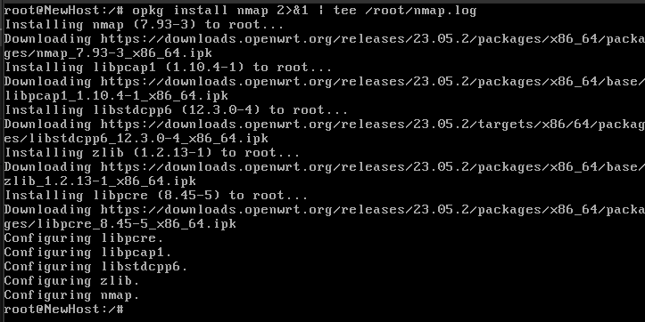

# Homework 15 | `Deadline 19 February` | OpenWRT buildroot
## Topics in this lecture:
- Introduction, HW archs 
- Usage, application
- UCI (Configuration)
- Buildroot (Compilation)
- Packages Structure
- Licenses


## Description of the homework
### Install OpenWRT to VirtualBox VM:
- Use the following instructions on how to install OpenWRT to Virtual BOX VM:
OpenWrt on VirtualBox HowTo: https://openwrt.org/docs/guide-user/virtualization/virtualbox-vm
- Follow ext4 OpenWRT version installation and use the following OpenWRT screen/screen/image:
https://archive.openwrt.org/releases/23.05.2/targets/x86/64/openwrt-23.05.2-x86-64-generic-ext4-combined.img.gz
- Configure 2x Network Interfaces in the Virtualbox settings for the OpenWRT Virtual Machine: Adapter1: Bridged to Public internet interface and Adapter 2: Host-Only network Interface.
NOTE:Adapter 1 will be mapped to eth0 interface in the OpenWRT and Adapter 2 - to the eth1 interface
- Configure Public network adapter in the OpenWRT Linux
Public network adapter (eth0) is added to the Bridge by default.
Configure Public network adapter to receive IPv4 address via DHCP and make those configuration persistent between the reboots.
- Configure Host-Only Network Adapter in the OpenWRT Linux:
Add network.lan_host network configuration
Add eth1 as a network device for the lan_host network
Configure Host-Only network adapter to receive IPv4 address via DHCP and make this configuration persistent between the reboots.
- Add new firewall zone “host” for the network lan_host with the following policies: input=ACCEPT, output=ACCEPT, forward=ACCEPT.
Save and apply changes on-fly (no reboots should be done). 
- Change root password
- Login via SSH from Host PC or Ubuntu VM using Host network IP addresses and root user credentials.
- Change OpenWRT Hostname, save and apply configuration.
- Update OpenWRT packages list
- Store available and installed OpenWRT Packages list to file.
- Install nmap package and store nmap package installation log somewhere.
- Run port scan using nmap against the Host PC.


## Work in Progress
### Install OpenWRT to VirtualBox VM:
- Use the following instructions on how to install OpenWRT to Virtual BOX VM:
OpenWrt on VirtualBox HowTo: https://openwrt.org/docs/guide-user/virtualization/virtualbox-vm


- Follow ext4 OpenWRT version installation and use the following OpenWRT screen/screen/image:
https://archive.openwrt.org/releases/23.05.2/targets/x86/64/openwrt-23.05.2-x86-64-generic-ext4-combined.img.gz

``` Bash
gzip -d resources/openwrt-23.05.2-x86-64-generic-ext4-combined.img.gz
```


``` Bash
ls
```


``` Bash
VBoxManage convertfromraw --format VDI openwrt-23.05.2-x86-64-generic-ext4-combined.img openwrt.vdi
```


``` Bash
ls
```


``` VirtualBox
File -> Tools -> Virtual Media Manager -> Add -> openwrt.vdi
```


- Configure 2x Network Interfaces in the Virtualbox settings for the OpenWRT Virtual Machine: Adapter1: Bridged to Public internet interface and Adapter 2: Host-Only network Interface.
NOTE:Adapter 1 will be mapped to eth0 interface in the OpenWRT and Adapter 2 - to the eth1 interface

``` VirtualBox
Tools -> Settings -> Network -> Host-only Networks -> Create
```


``` Bash
ip a
```


- Configure Public network adapter in the OpenWRT Linux
Public network adapter (eth0) is added to the Bridge by default.
Configure Public network adapter to receive IPv4 address via DHCP and make those configuration persistent between the reboots.

- Configure Host-Only Network Adapter in the OpenWRT Linux:
Add network.lan_host network configuration
Add eth1 as a network device for the lan_host network
Configure Host-Only network adapter to receive IPv4 address via DHCP and make this configuration persistent between the reboots.

``` Bash
uci show network.lan
```


``` Bash
# Або через 'vi /etc/config/network'
uci set network.wan.device='eth0'
uci set network.wan.proto='dhcp'
uci set network.lan_host=interface
uci set network.lan_host.proto='dhcp'
uci set network.lan_host.device='eth1'
```


``` Bash
uci commit network
/etc/init.d/network restart
```


``` Bash
ping 8.8.8.8 -c 4
```


``` Bash
uci show network.wan
```


``` Bash
ifconfig -a | less
```


``` Bash
uci show network.lan_host
```


``` Bash
ping 192.168.56.1 -c 4
```


- Add new firewall zone “host” for the network lan_host with the following policies: input=ACCEPT, output=ACCEPT, forward=ACCEPT.
Save and apply changes on-fly (no reboots should be done). 

``` Bash
uci add firewall zone
```


``` Bash
uci set firewall.@zone[-1].name='host'
uci set firewall.@zone[-1].network='lan_host'
uci set firewall.@zone[-1].input='ACCEPT'
uci set firewall.@zone[-1].output='ACCEPT'
uci set firewall.@zone[-1].forward='ACCEPT'
```


``` Bash
uci commit firewall
/etc/init.d/firewall reload
```


``` Bash
uci show firewall.@zone[2]
```


- Change root password

``` Bash
passwd
```


- Login via SSH from Host PC or Ubuntu VM using Host network IP addresses and root user credentials.

**Не зробив**


- Change OpenWRT Hostname, save and apply configuration.

``` Bash
uci set system.@system[0].hostname='NewHost'
uci commit system
/etc/init.d/system reload
```


``` Bash
uci get system.@system[0].hostname
```


- Update OpenWRT packages list

``` Bash
opkg update
```


- Store available and installed OpenWRT Packages list to file.

``` Bash
opkg list > /root/packages.txt
ll /root
```


- Install nmap package and store nmap package installation log somewhere.

``` Bash
opkg install nmap 2>&1 | tee /root/nmap.log
```



``` Bash
cat /root/nmap.log
```


- Run port scan using nmap against the Host PC.

``` Bash
nmap 192.168.56.3
```

