# Homework 16 | `Deadline 25 February` | Remote network access
## Topics in this lecture:
- Concept of the remote access
    (command line access with telnet(mactelnet), ssh)
- File/data access
    (ftp, tftp, sftp, scp)
- SSH tunneling
- Networking Filesystems
    (NFS, SSHFS, SAMBA)


## Description of the homework
- Secure Shell allows configuring custom behavior for selected keys in authorized_keys (see authorized_keys(5)). On a selected machine (you can configure localhost this way and self-connect) for an arbitrary user (it may be your default user) make your key run a certain command that fulfills the Expected result.


## Work in Progress
- Secure Shell allows configuring custom behavior for selected keys in authorized_keys (see authorized_keys(5)). On a selected machine (you can configure localhost this way and self-connect) for an arbitrary user (it may be your default user) make your key run a certain command that fulfills the Expected result.

``` Bash
# Ubuntu Server
sudo apt install network-manager
```

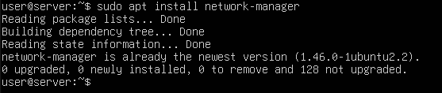

``` Bash
# Ubuntu Server
nmcli device wifi list
```

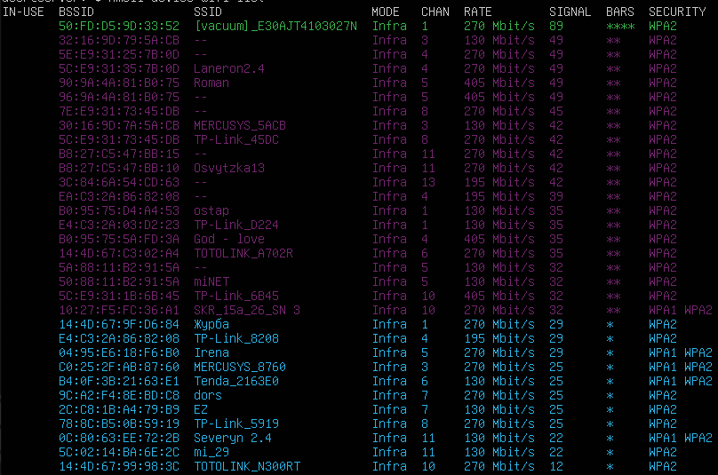

``` Bash
# Ubuntu Server
nmcli dev wifi connect "Osvytzka13" password "61083022"
```

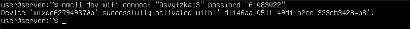

``` Bash
# Ubuntu Server: 192.168.3.99
ip a
```

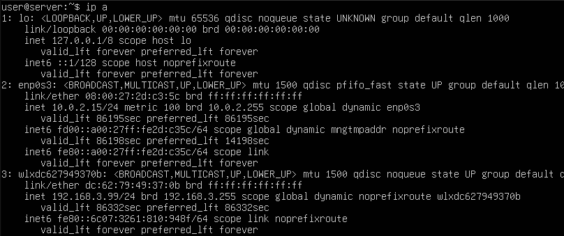

``` Bash
# Ubuntu Server: 192.168.3.99
sudo apt install openssh-server
```

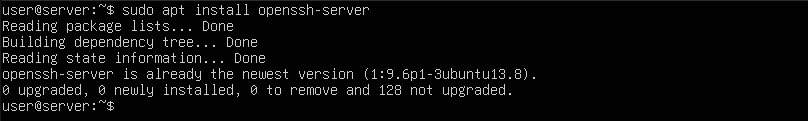

``` Bash
# Ubuntu Server: 192.168.3.99
sudo nano /etc/ssh/sshd_config
# Port 30001 (Рекомендація лектора Сергія)
# PermitRootLogin no
# MaxAuthTries 3 (Рекомендація лектора Сергія)
# PubkeyAuthentication yes
# AuthorizedKeysFile .ssh/authorized_keys

sudo systemctl restart ssh
sudo systemctl enable ssh
```

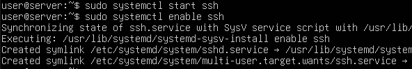

``` Bash
# Ubuntu Desktop: 192.168.3.102
ssh-keygen -t rsa -C "Homework16"
```

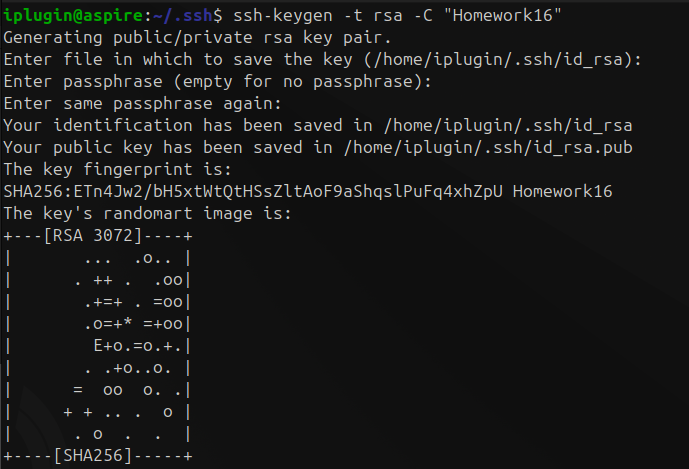

``` Bash
# Ubuntu Desktop: 192.168.3.102
ll
```

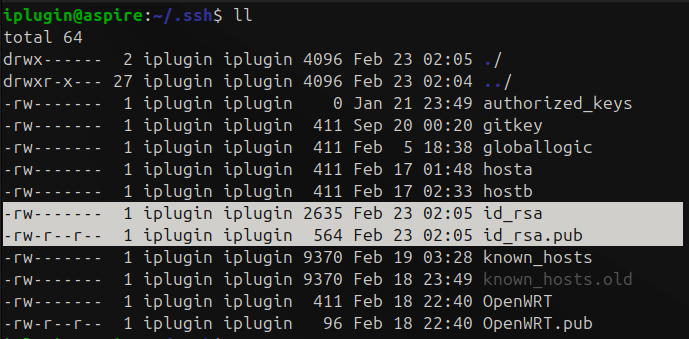

``` Bash
# Ubuntu Desktop: 192.168.3.102
ssh-copy-id -i ~/.ssh/id_rsa -o "Port=30001" user@192.168.3.99
```

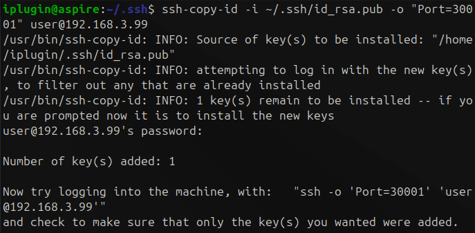

``` Bash
# Ubuntu Desktop: 192.168.3.102
ssh -i ~/.ssh/id_rsa -p 30001 user@192.168.3.99
```

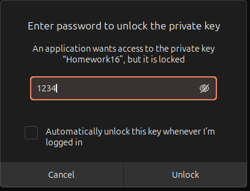

**Не очікувано але це якесь оновлення від Ubuntu і як я зрозумів - працює як ssh-agent**

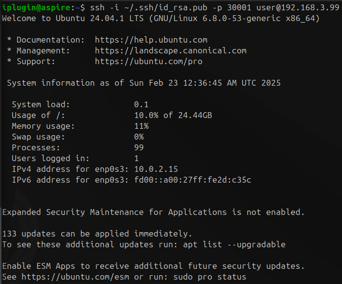

``` Bash
# Ubuntu Server: 192.168.3.99
sudo nano /etc/ssh/sshd_config
```

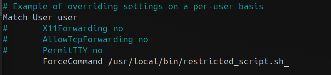

``` Bash
# Ubuntu Server: 192.168.3.99
sudo nano /usr/local/bin/restricted_script.sh
```

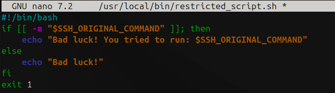

``` Bash
# Ubuntu Server: 192.168.3.99
sudo chmod +x /usr/local/bin/restricted_script.sh
sudo systemctl restart ssh
exit
```

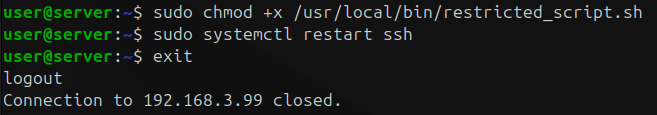

``` Bash
# Ubuntu Desktop: 192.168.3.102: 1/4 Вхід з валідним ключем
ssh -i ~/.ssh/id_rsa -p 30001 user@192.168.3.99
```

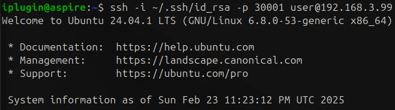

``` Bash
# Ubuntu Desktop: 192.168.3.102: 2/4 Вхід з валідним ключем + командою
ssh -i ~/.ssh/id_rsa -p 30001 user@192.168.3.99 ls -la
```

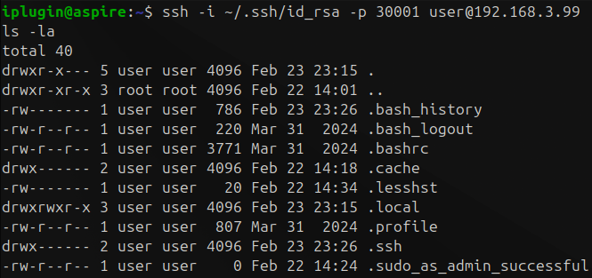

``` Bash
# Ubuntu Desktop: 192.168.3.102: 3/4 Вхід з НЕ валідним ключем
rm -f .ssh/known_hosts
rm -f .ssh/known_hosts.old
ssh -i ~/.ssh/globallogic -p 30001 user@192.168.3.99
```

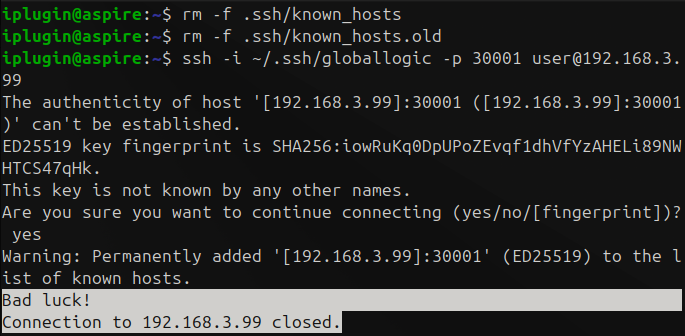

``` Bash
# Ubuntu Desktop: 192.168.3.102: 4/4 Вхід з НЕ валідним ключем + командою
ssh -i ~/.ssh/globallogic -p 30001 user@192.168.3.99 ls -la
```

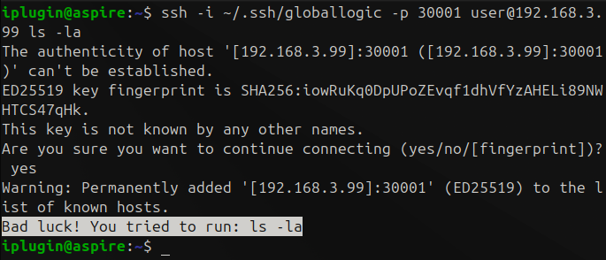

```
Привіт Яніно 👋🏼, байдуже на результат на курсу пройду чи ні, але хочу просто подякувати 🤗, було впізнавально і цікаво - мені дуже сподобалося 🔥
```