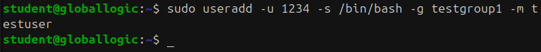

# Homework 1 | `Deadline 17 Dec` | Starting with Linux
## Topics in this lecture:
- GNU/Linux overview, Kernel, drivers, GUI, userspace processes
- Linux distributives
- Users, groups, passwords
- File attributes
- Processes vs daemons
- Background processes
- Signals and killing
- Ubuntu installation to virtual machine

## Description of the homework
### Ubuntu Linux installation to the Virtual Box VM, configure host-only network and organize network connection between the main PC and VM.
- Add new group “testgroup1” with GID 1234
- Add new group “testgroup2” with GID 4321
- Add new user “testuser” with UID 1234, Shell: /bin/bash, primary group = “testgroup1”, create homedir automatically.
- Add new user “testuser2” with UID 4321, Shell: /bin/bash, primary group = “testgroup2”, create homedir automatically.
- Rename “testuser” to “testuser1”
- Modify “testuser1” directory to be the same as username.

## Work in Progress
### Ubuntu Linux installation to the Virtual Box VM, configure host-only network and organize network connection between the main PC and VM.
- Add new group “testgroup1” with GID 1234
``` Bash
sudo groupadd -g 1234 testgroup1
```


``` Bash
cat /etc/group
```


- Add new group “testgroup2” with GID 4321
``` Bash
sudo groupadd -g 4321 testgroup2
```


``` Bash
cat /etc/group
```


- Add new user “testuser” with UID 1234, Shell: /bin/bash, primary group = “testgroup1”, create homedir automatically.
``` Bash VM
sudo useradd -u 1234 -s /bin/bash -g testgroup1 -m testuser
```



``` Bash
cat /etc/passwd
```


- Add new user “testuser2” with UID 4321, Shell: /bin/bash, primary group = “testgroup2”, create homedir automatically.
``` Bash VM
sudo useradd -u 4321 -s /bin/bash -g testgroup2 -m testuser2
```


``` Bash
cat /etc/passwd
```


- Rename “testuser” to “testuser1”
``` Bash VM
sudo usermod -l testuser1 testuser
```


``` Bash
cat /etc/passwd
```


- Modify “testuser1” directory to be the same as username.
``` Bash VM
sudo usermod -d /home/testuser1 testuser1
```


``` Bash
cat /etc/passwd
```

