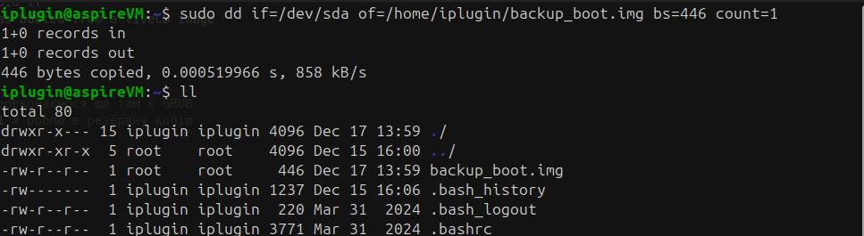
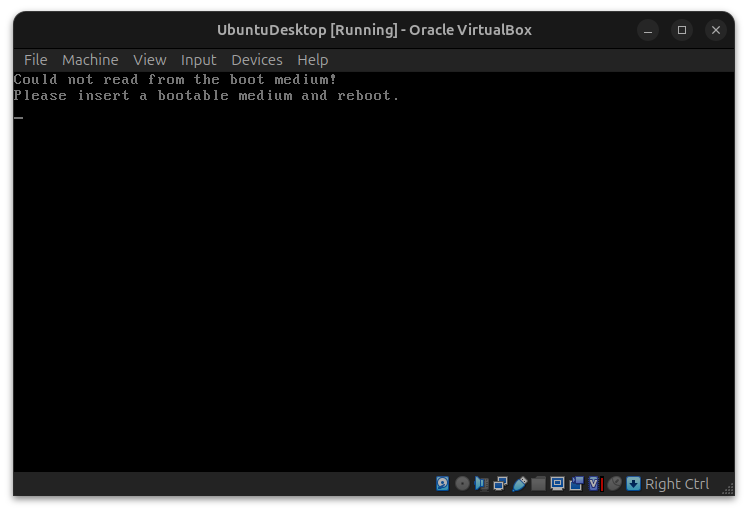
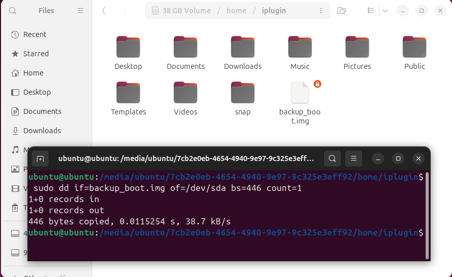
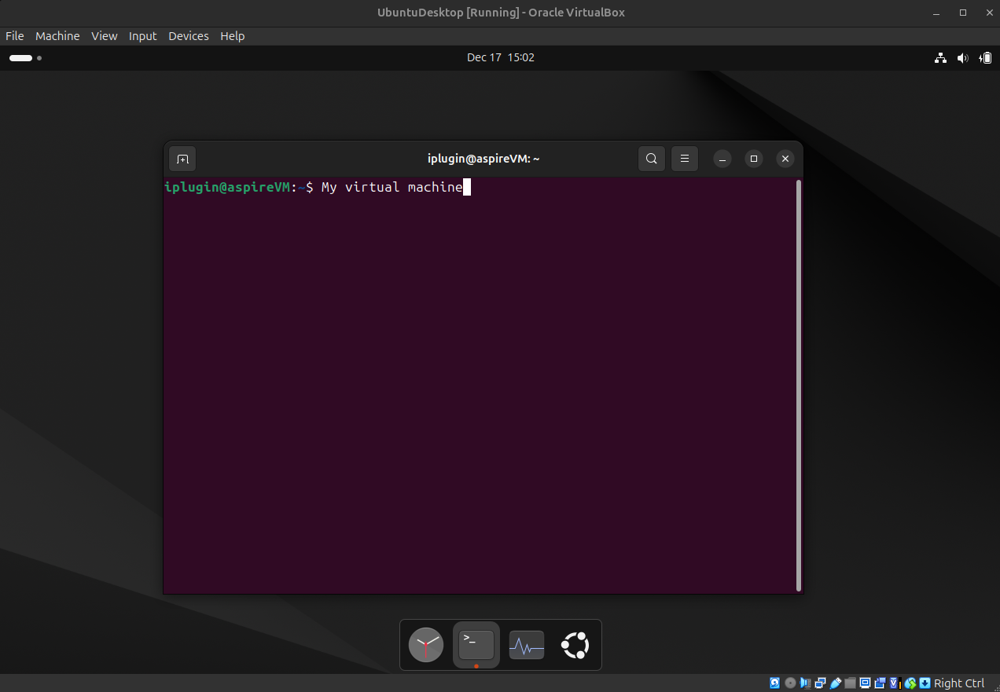

# Вітаю Yanina Husarevych

# Description of the homework
Figure it our where is located a GRUB bootloader
- Save the bootloader to a separate file on a disk
- Remove GRUB bootloader
- Reboot VM to see OS does not boot anymore
- Using an Ubuntu live cd, boot into recovery mode and restore bootloader
- Take a few pictures/screenshots in a progress to reveal how you did it
- Note down a commands you’ve used to recover a bootloader while was booted from a liveCD image

# Work in Progress
## Save the bootloader to a separate file on a disk
``` Bash
sudo dd if=/dev/sda bs=512 count=1 | hexdump -C | grep -i grub # переконаємося що на диску є GRUB
sudo dd if=/dev/sda of=/home/iplugin/backup_boot.img bs=446 count=1 # роблю резервну копію
```

## Remove GRUB bootloader
``` Bash
sudo dd if=/dev/zero of=/dev/sda bs=446 count=1 # обнулив все
```

## Reboot VM to see OS does not boot anymore
``` Bash
reboot
```


## Using an Ubuntu live cd, boot into recovery mode and restore bootloader
За допомогою ISO образу заходжу на віртуалку


В ній знаходжу файл `backup_boot.img` який я зберіг [ось тут](#save-the-bootloader-to-a-separate-file-on-a-disk)



І перезавантажую
``` Bash
reboot
```


# Expected result
- The VBox machine is fully functional

