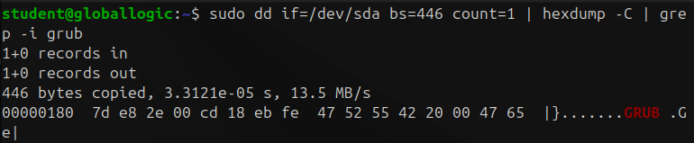
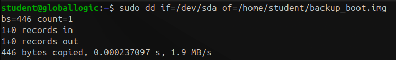
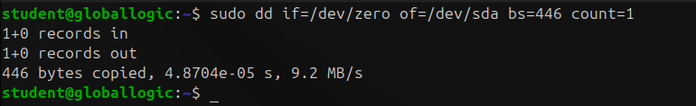
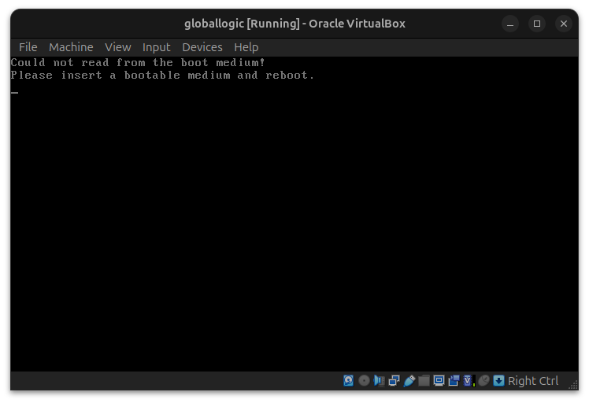
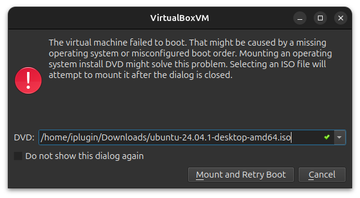
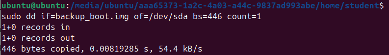
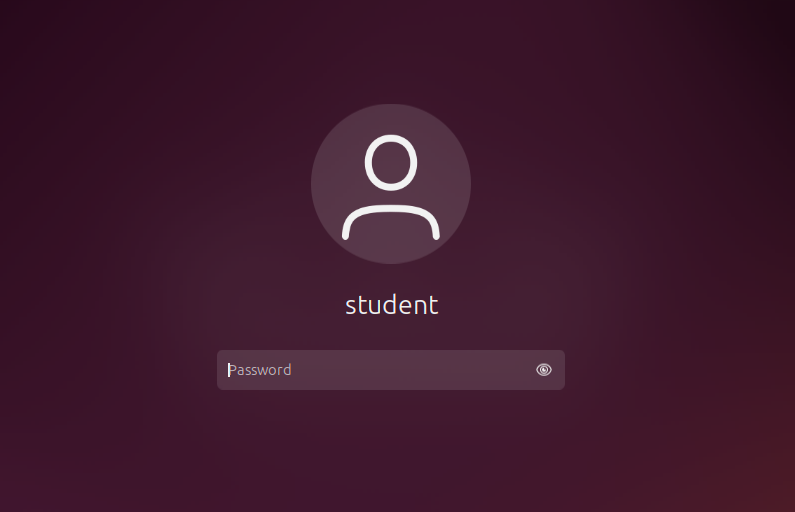

# Homework 2 | `Deadline 18 Dec` | [Presentation](https://github.com/iPlugin/EDUC/blob/main/os_linux/pres/GlobalLogic%20Lec2%20Booting%20Linux.pdf)
## Topics in this lecture:
- GNU/Linux overview,
- What is an Operating System boot,
- CPU and ROM code, how it starts
- 1st stage - BIOS, CSM, MBR, (U)EFI,
- 2nd stage - BIOS, Grub, U-Boot, ntloader.exe
- 3rd stage - Linux Kernel, initrd, drivers,
- System boot stage:
    - GUI, userspace processes
    - Processes vs daemons
    - Background processes
- Linux distributives and their core parts
    - Init
    - Basic libraries set (GNU vs non-GNU)

## Description of the homework
### Remove the bootloader from the command line
### Recover using install cd screen/image

## Work in Progress
### Remove the bootloader from the command line
``` Bash
sudo dd if=/dev/sda bs=446 count=1 | hexdump -C | grep -i grub
```



``` Bash
sudo dd if=/dev/sda of=/home/student/backup_boot.img bs=446 count=1
```



``` Bash
sudo dd if=/dev/zero of=/dev/sda bs=446 count=1
```




``` Bash
reboot
```



## Recover using install cd screen/image



``` Bash
sudo dd if=back_boot.img of=/dev/sda bs=446 count=1
```



``` Bash
reboot
```

