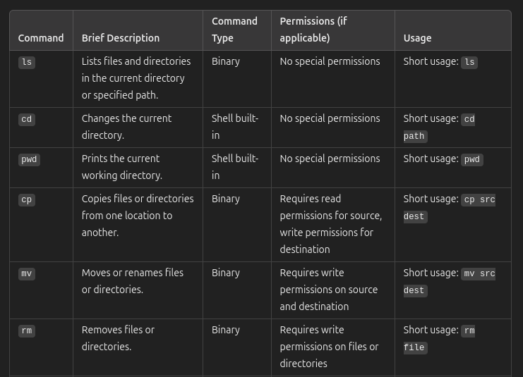

# Вітаю Yanina Husarevych
Викладач Сергій сказав не робити 1, 2 пункт поки-що! На записі 3 лекції 2:15:30 - 2:16:35

# Description of the homework
1. Block/Allow file deletion from directory by other users:
- Create test_tmp directory in /home folder from using the root user permissions
- Set rwx permissions for the owner, group and others to /home/test_tmp
- Create test TEXT files in /home/test_tmp folder with testuser1 permissions
- Create test TEXT files in /home/test_tmp folder with testuser2 permissions
- Block file deletion from this directory by other users
- Try deleting files belonging to testuser1 from the testuser2 account
- Allow file deletion from this directory by other users
- Try deleting files belonging to testuser1 from the testuser2 account
- Provide Terminal screenshots of the performed operations.

2. Verify that SUID bit does not work for executable Shell scripts.
- Create suid_test.sh script from the testuser1 credentials with the following content: “#!/bin/sh whoami”
- Set execution bit for everyone
- Try executing test_suid.sh script from different users
- Try changing UIDs to the different users to test_suid.sh and repeat Item# 3
- Provide Terminal screenshots of the performed operations.

3. Changing the Shell for the users:
- Install zsh
- Install tcsh
- Change shell to zsh for the user testuser1
- Log-in to CLI with the testuser1 credentials
- Output processes list for the testuser1
- Output processes list for the testuser2
- Change shell to tcsh for the user testuser2
- Log-in to CLI with the testuser2 credentials
- Output processes list for the root user
- Capture Screenshots for each of the Item above.

4. Exploring the Most useful commands:
- Create a table (text, excel/google sheet, e.t.c.) for the Most useful commands Chapter which would consist of the following rows:Brief Description/Command type(binary, shell built-in, e.t.c.)/Permissions(In case of separate binary)/Usage(Short or Traditional usage).

5. Find task:
- Find all files containing SUID bit in.
- Provide find options used
- Capture and provide an output for evaluation

# Work in Progress

3. Changing the Shell for the users
- Install zsh
- Install tcsh
``` Bash
sudo apt install zsh tcsh
```


- Change shell to zsh for the user testuser1
``` Bash
sudo usermod -s /usr/bin/zsh testuser1
```


- Log-in to CLI with the testuser1 credentials
``` Bash
sudo passwd testuser1
```


``` Bash
su testuser1
```


- Output processes list for the testuser1
``` Bash
ps aux | grep testuser1
```


- Output processes list for the testuser2
``` Bash
ps aux | grep testuser2
```


- Change shell to tcsh for the user testuser2

Тут мої варінти розійшлися бо не знаю від якого імені це робити можна добавити користувача testuser1 в sudoers і виконати наступні команди а можна вийти до користувача який вже має sudo і виконати цю команду. Я вирішив вийти бо нічого не пише перед тим щоб testuser1 добавити до групи sudo
``` Bash
exit
sudo usermod -s /usr/bin/tcsh testuser2
```


- Log-in to CLI with the testuser2 credentials
``` Bash
sudo passwd testuser2
```


``` Bash
su testuser2
```


- Output processes list for the root user
``` Bash
ps aux | grep root
```


- Capture Screenshots for each of the Item above.
```
Зробив :)
```


4. Exploring the Most useful commands

- Зайшов в ChatGpt, найбільш корисні команди в linux склади табличку з такими колонками Brief Description | Command type | Permissions | Usage.



- Переписувати це вручну я не збираюся бо їх там багато, тому: права кнопка миші -> inspect мені відкривається html код сторінки я знаходжу тег < table > і копіюю його


- Створюю .py файл і вставлю код туда, використовуючи бібліотеку BeautifulSoup я шукаю елемети таблиці і це все через цикл `for` і записую в файл commands.txt
``` Bash
python3 hm3/main.py
```


- Тепер маючи .txt файл який між кожною колонкою проставлено `;` а між кожним рядоком `\n`, я можу виводити команди в термінал, за допомогою команди:
``` Bash
cat hm3/commands.txt | column -t -s ';'
```


5. Find task
- Find all files containing SUID bit in
``` Bash
sudo find / -type f -perm /u=s 2> /dev/null > hm3/suid_files.txt
```

- Provide find options used (Не впевнений що правильно зрозумів що від мене вимагається)
    - `/` : шлях з якого почати рекрусивний пошук
    - `-type f` : тип того що шукаємо в нашому випадку файл
    - `-perm /u=s` : будь-яка комбінація прав з встановленим SUID
    - `2> /dev/null` : це потік для помилок який веде в смітник
    - `> suid_files.txt` : це потік для стандартного виводу

- Capture and provide an output for evaluation


# Expected result
1. Block/Allow file deletion from directory by other users:
Items #1-8 performed, 
Screenshots provided.

2. Verify that SUID bit does not work for executable Shell scripts:
Item #1-4 performed,
Screenshots provided

3. Changing the Shell for the users:


4. Exploring the Most useful commands:
Extended table with additional information for the “Most useful commands” is created and provided for evaluation


5. Find task:
Find command arguments is provided
List of files with SUID bit is provided for evaluation

