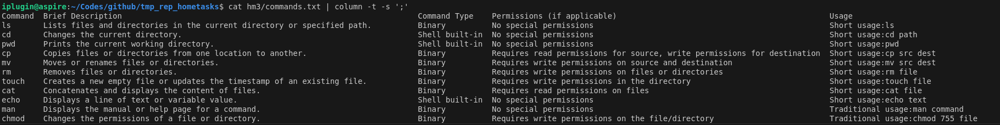

# Homework 3 | `Deadline 24 Dec` | [Presentation](https://github.com/iPlugin/EDUC/blob/main/os_linux/pres/GlobalLogic%20Lec3%20Command%20line%20part1.pdf)
## Topics in this lecture:
- GNU/Linux overview,
- Terminal vs console vs Shell 
- Command structure. 
- Starting in background
- man 
- Most usefull commands 
- package installation
- Navigation 
- File operations 
- find 
- Escaping

## Description of the homework
### Block/Allow file deletion from directory by other users:
- Create test_tmp directory in /home folder from using the root user permissions
- Set rwx permissions for the owner, group and others to /home/test_tmp
- Create test TEXT files in /home/test_tmp folder with testuser1 permissions
- Create test TEXT files in /home/test_tmp folder with testuser2 permissions
- Block file deletion from this directory by other users
- Try deleting files belonging to testuser1 from the testuser2 account
- Allow file deletion from this directory by other users
- Try deleting files belonging to testuser1 from the testuser2 account
- Provide Terminal screenshots of the performed operations.

### Verify that SUID bit does not work for executable Shell scripts.
- Create suid_test.sh script from the testuser1 credentials with the following content: 	“#!/bin/sh whoami”
- Set execution bit for everyone
- Try executing test_suid.sh script from different users
- Try changing UIDs to the different users to test_suid.sh and repeat Item# 3
- Provide Terminal screenshots of the performed operations.

### Changing the Shell for the users:
- Install zsh
- Install tcsh
- Change shell to zsh for the user testuser1
- Log-in to CLI with the testuser1 credentials
- Output processes list for the testuser1
- Output processes list for the testuser2
- Change shell to tcsh for the user testuser2
- Log-in to CLI with the testuser2 credentials
- Output processes list for the root user
- Capture Screenshots for each of the Item above.

### Exploring the Most useful commands:
- Create a table (text, excel/google sheet, e.t.c.) for the Most useful commands Chapter which would consist of the following rows:Brief Description/Command type(binary, shell built-in, e.t.c.)/Permissions(In case of separate binary)/Usage(Short or Traditional usage).

### Find task:
- Find all files containing SUID bit in.
- Provide find options used
- Capture and provide an output for evaluation

## Work in Progress
### Block/Allow file deletion from directory by other users:
- Create test_tmp directory in /home folder from using the root user permissions
``` Bash
sudo su
mkdir /home/test_tmp
```


``` Bash
ll /home
```


- Set rwx permissions for the owner, group and others to /home/test_tmp

``` Bash
sudo su
chmod 777 /home/test_tmp
```


``` Bash
ll /home/test_tmp
```


- Create test TEXT files in /home/test_tmp folder with testuser1 permissions
``` Bash
sudo passwd testuser1
su testuser1
touch /home/test_tmp/file1.txt
```


``` Bash
ll /home/test_tmp/
```


- Create test TEXT files in /home/test_tmp folder with testuser2 permissions
``` Bash
sudo passwd testuser2
su testuser2
touch /home/test_tmp/file2.txt
```


``` Bash
ll /home/test_tmp/
```


- Block file deletion from this directory by other users
``` Bash
sudo chmod 775 /home/test_tmp/
```


``` Bash
ll /home/test_tmp/
```


- Try deleting files belonging to testuser1 from the testuser2 account
``` Bash
su testuser2
rm -f /home/test_tmp/file1.txt
```


- Allow file deletion from this directory by other users
``` Bash
sudo chmod 777 /home/test_tmp/
```


``` Bash
ll /home/test_tmp/
```


- Try deleting files belonging to testuser1 from the testuser2 account
``` Bash
su testuser1
rm -f /home/test_tmp/file2.txt
```


``` Bash
ll /home/test_tmp/
```


### Verify that SUID bit does not work for executable Shell scripts.
- Create suid_test.sh script from the testuser1 credentials with the following content: 	“#!/bin/sh whoami”
``` Bash
su testuser1
nano suid_test.sh /home/test_tmp/
```


``` Bash
ll /home/test_tmp/
```


- Set execution bit for everyone
``` Bash
chmod 4755 /home/test_tmp/suid_test.sh
```


``` Bash
ll /home/test_tmp/
```


- Try executing test_suid.sh script from different users
``` Bash
/home/test_tmp/suid_test.sh
su testuser1
/home/test_tmp/suid_test.sh
su testuser2
/home/test_tmp/suid_test.sh
```


- Try changing UIDs to the different users to test_suid.sh and repeat Item# 3
``` Bash
sudo chown testuser2:testgroup2 /home/test_tmp/suid_test.sh
```


``` Bash
/home/test_tmp/suid_test.sh
su testuser1
/home/test_tmp/suid_test.sh
su testuser2
/home/test_tmp/suid_test.sh
```


---
Все стверджує що має працювати але не працює. А ChatGPT взагалі пише що Bash скрипти не виконуються таким чином

---


### Changing the Shell for the users:
- Install zsh
``` Bash
sudo apt install zsh
```


- Install tcsh
``` Bash
sudo apt install tcsh
```


- Change shell to zsh for the user testuser1
``` Bash
sudo usermod -s /usr/bin/zsh testuser1
```


- Log-in to CLI with the testuser1 credentials
``` Bash
su testuser1
```


- Output processes list for the testuser1
``` Bash
ps aux | grep testuser1
```


- Output processes list for the testuser2
``` Bash
ps aux | grep testuser2
```


- Change shell to tcsh for the user testuser2
``` Bash
sudo usermod -s /usr/bin/tcsh testuser2
```


- Log-in to CLI with the testuser2 credentials
``` Bash
su testuser2
```


- Output processes list for the root user
``` Bash
ps aux | grep root
```


### Exploring the Most useful commands:
- Create a table (text, excel/google sheet, e.t.c.) for the Most useful commands Chapter which would consist of the following rows:Brief Description/Command type(binary, shell built-in, e.t.c.)/Permissions(In case of separate binary)/Usage(Short or Traditional usage).
```
Я: Найбільш корисні команди в linux склади табличку з такими колонками Brief Description | Command type | Permissions | Usage
ChatGPT: Ось тримай!
```


```
Переписувати це вручну я не збираюся бо їх там багато, тому: права кнопка миші -> inspect мені відкривається html код сторінки я знаходжу тег <table> і копіюю його
```


```
Створюю `getInfornationFromInternet.py` файл і вставлю код туда, використовуючи бібліотеку BeautifulSoup я шукаю елемети таблиці і це все через цикл for і записую в файл `theMostUsefulCommands.txt`
```


```
Тепер маючи .txt файл який між кожною колонкою проставлено ; а між кожним рядоком \n, я можу виводити команди в термінал, за допомогою команди:
```
``` Bash
cat /home/test_tmp/theMostUsefulCommands.txt | column -t -s ';'
```




### Find task:
- Find all files containing SUID bit in.
``` Bash
sudo find / -type f -perm /u=s 2> /dev/null
```


- Provide find options used (Не впевнений що правильно зрозумів що від мене вимагається)
    - `/` : шлях з якого почати рекрусивний пошук
    - `-type f` : тип того що шукаємо в нашому випадку файл
    - `-perm /u=s` : будь-яка комбінація прав з встановленим SUID
    - `2> /dev/null` : це потік для помилок який веде в смітник
    - `> suid_files.txt` : це потік для стандартного виводу