# Homework 4 | `Deadline 24 Dec` | Linux command line intro. Part 2
## Topics in this lecture:
- Input/output streams
- Pipes
- Wildcards
- vim 
- bash / sh
- bash variables
- special variables
- Eval, $(), ``, xargs

## Description of the homework
### Packages installation
- Install vim package
- Add new APT repository from PPA and install popular “telegram” messendger: ppa:atareao/telegram
- Investigate and find-out where new PPA was stored in the FS: /etc/apt/…
- Investigate where GPG key was stored and how it was verified.
- Investigate where telegram APP files were placed to the FS.
- Run telegram APP from Ubuntu GUI.
- Find-out “telegram” app PID, process entry and parameters (use appropriate CLI app).
- Remove telegram APP using “apt-get” application from CLI.
- Remove telegram PPA repo from the system using CLI.

### Additional find task: 
- Find out how to find files bigger than 1Gb in size and perform finding operations across the whole filesystem.
- Find out how to find empty files and directories and perform finding in the system temporary directory.
- Find out how to find all files and directories in the user’s home directory which were changed within the last hour and find them.
- Perform the Item above but for the files and directories accessed within the last hour.
- Find all files with permissions for reading, writing and executing for the owner, group and others in the user’s home directory.

### Vimtutor task
- Install vimtutor
- Run and practice vimtutor

### Extending user’s BASH profile.
- Define and add alias “psw” which will display all processes for all users with wide output to the user’s bash profile.
- Add shell function “arps” displaying ARP table from the /proc/net/arp node.

## Work in Progress
### Packages installation
- Install vim package
``` Bash
sudo apt install vim
```

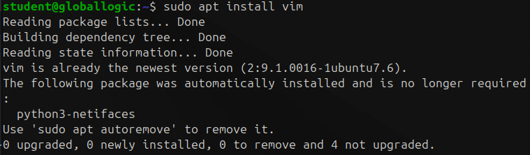

``` Bash
vim --version
```

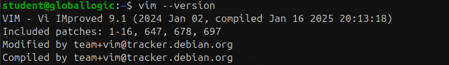

- Add new APT repository from PPA and install popular “telegram” messendger: `ppa:atareao/telegram`
``` Bash
sudo add-apt-repository ppa:atareao/telegram
```

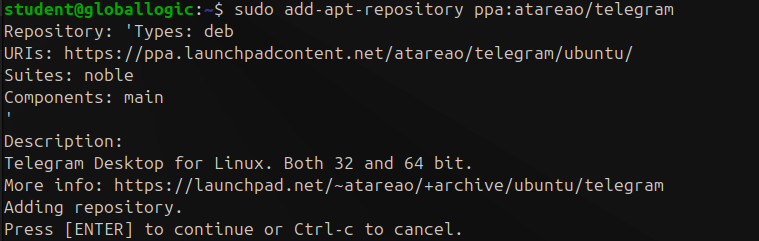

``` Bash
sudo apt install telegram
```

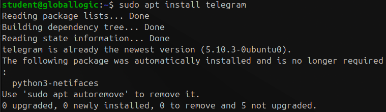

- Investigate and find-out where new PPA was stored in the FS: /etc/apt/…
``` Bash
ll /etc/apt/sources.list.d
```

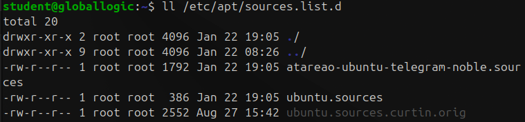

- Investigate where GPG key was stored and how it was verified.
``` Bash
ll /etc/apt/trusted.gpg.d/
```

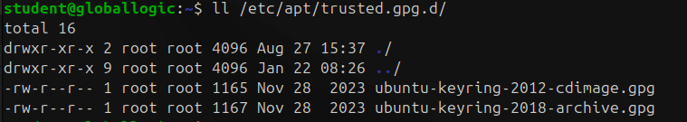

- Investigate where telegram APP files were placed to the FS.
``` Bash
dpkg -L telegram
```

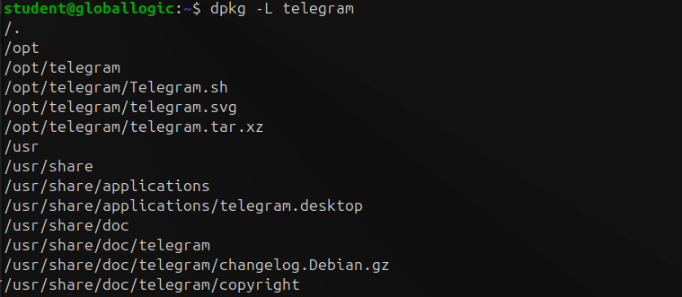

- Run telegram APP from Ubuntu GUI


- Find-out “telegram” app PID, process entry and parameters (use appropriate CLI app).
``` Bash
ps aux | grep "telegram"
```

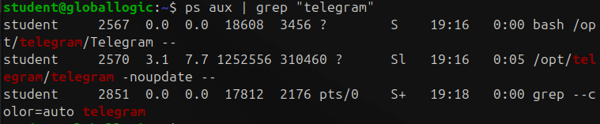

- Remove telegram APP using “apt-get” application from CLI.
``` Bash
sudo apt-get remove telegram
```

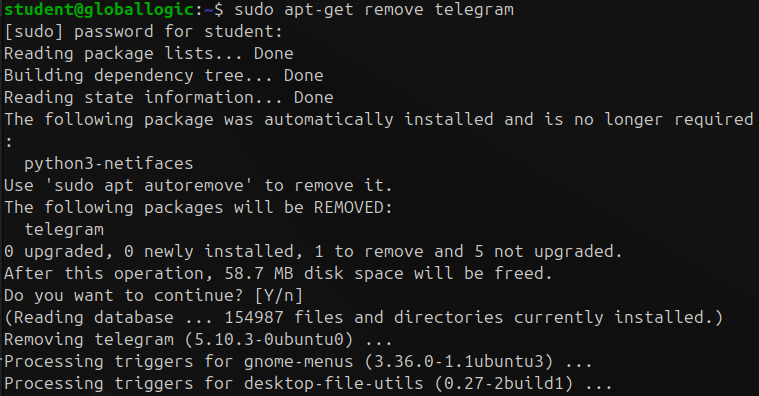

- Remove telegram PPA repo from the system using CLI.
``` Bash
sudo add-apt-repository --remove ppa:atareao/telegram
```

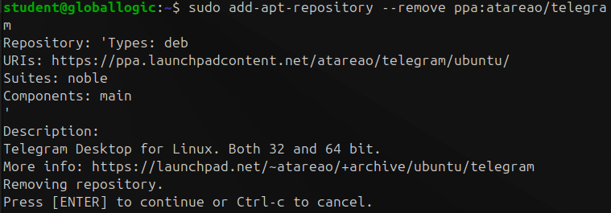


### Additional find task: 
- Find out how to find files bigger than 1Gb in size and perform finding operations across the whole filesystem.
``` Bash
sudo find / -type f -size +1G 2> /dev/null
```

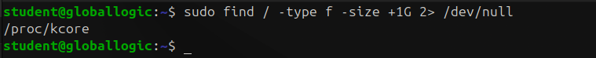

- Find out how to find empty files and directories and perform finding in the system temporary directory.
``` Bash
sudo find /tmp -empty
```

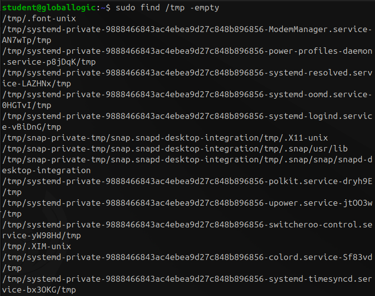

- Find out how to find all files and directories in the user’s home directory which were changed within the last hour and find them.
``` Bash
sudo find ~ -mmin -60 2> /dev/null
```

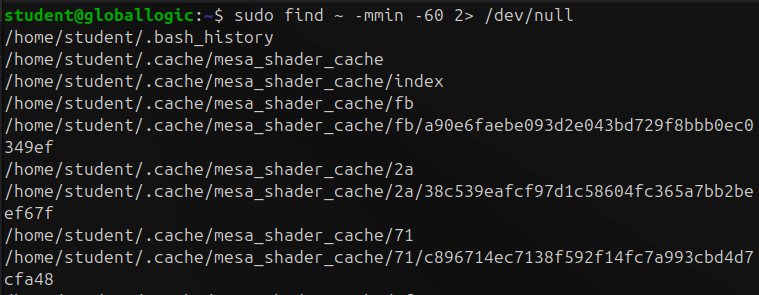

- Perform the Item above but for the files and directories accessed within the last hour.
``` Bash
sudo find ~ -amin -60 2> /dev/null
```

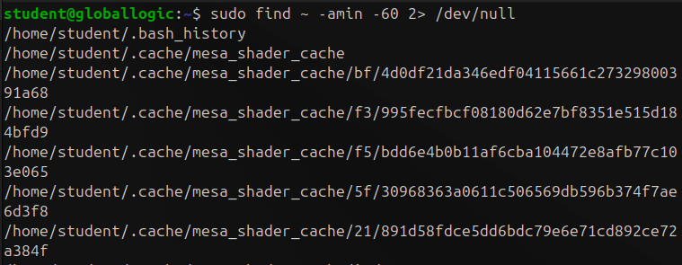

- Find all files with permissions for reading, writing and executing for the owner, group and others in the user’s home directory.

``` Bash
sudo find ~ -type f -perm 777
```

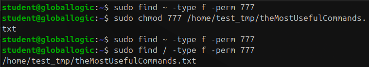

### Vimtutor task
- Install vimtutor

``` Bash
which vimtutor
```

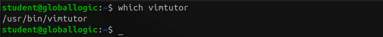

- Run and practice vimtutor

``` Bash
vimtutor
```

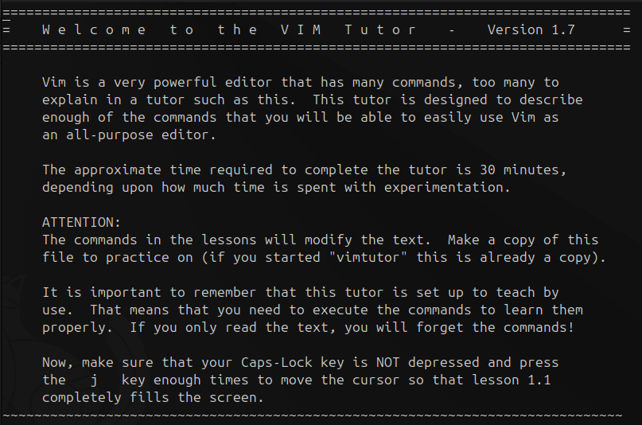


### Extending user’s BASH profile.
- Define and add alias “psw” which will display all processes for all users with wide output to the user’s bash profile.

``` Bash
vim ~/.bashrc
```

`Перейти в insert режим Esc -> i`

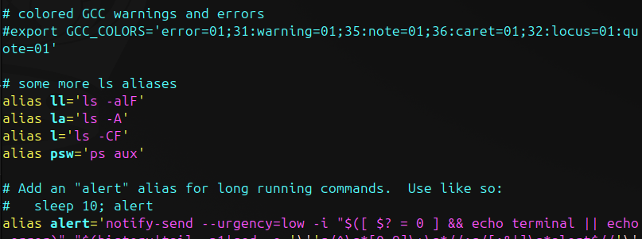

`Зберегти і вийти Esc -> :wq`

``` Bash
source ~/.bashrc
psw
```

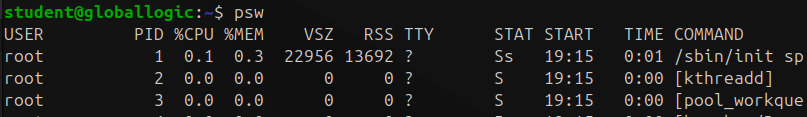

- Add shell function “arps” displaying ARP table from the /proc/net/arp node.

``` Bash
vim ~/.bashrc
```

`Перейти в insert режим Esc -> i`

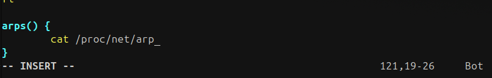

`Зберегти і вийти Esc -> :wq`

``` Bash
source ~/.bashrc
arps
```

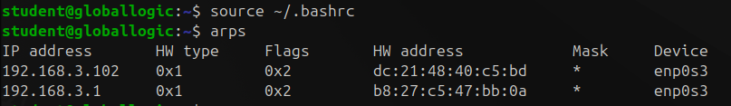