# Вітаю Yanina Husarevych
## Description of the homework
### Block/Allow file deletion from directory by other users:
- Create test_tmp directory in /home folder from using the root user permissions
- Set rwx permissions for the owner, group and others to /home/test_tmp
- Create test TEXT files in /home/test_tmp folder with testuser1 permissions
- Create test TEXT files in /home/test_tmp folder with testuser2 permissions
- Block file deletion from this directory by other users
- Try deleting files belonging to testuser1 from the testuser2 account
- Allow file deletion from this directory by other users
- Try deleting files belonging to testuser1 from the testuser2 account
- Provide Terminal screenshots of the performed operations.

### Verify that SUID bit does not work for executable Shell scripts.
- Create suid_test.sh script from the testuser1 credentials with the following content: “#!/bin/sh whoami”
- Set execution bit for everyone
- Try executing test_suid.sh script from different users
- Try changing UIDs to the different users to test_suid.sh and repeat Item# 3
- Provide Terminal screenshots of the performed operations.

### Adding/Creating New Storage Devices to the Linux OS:
- Add 3x new Disk controllers to the Virtual Machine: SCSI, SAS and NVME(NOTE: Extension pack to VBox must be added in order to use NVME Controllers).
- Add 2xNew HDDs to each of the Disk Controllers (Select VDI, Dynamic Allocation 1Gb size)
- Verify which device nodes were created in the /dev folder for each of the Drives added.
- Create MBR partition table with a total of 4x partitions similar in size ( 2x Primary and 2x Logical partitions)  for the 1st drive for SCSI and NVME disk controllers using parted utility. (25%, 50%, 75%,100% can be used when specifying partition size)
- Create GPT partition table with a total of 4x partitions similar in size for the 2nd drive for SCSI and NVMEdisk controllers using parted utility. (25%, 50%, 75%,100% can be used when specifying partition size).
- Create MBR partition table with a total of 4x partitions similar in size ( 2x Primary and 2x Logical partitions)  for the 1st drive for SAS disk controller using fdisk utility
- Create GPT partition table with a total of 4x partitions similar in size for the 2nd drive for SAS disk controller using fdisk utiliy.
- Compare Partition Table display information using fdisk and parted utilities.
- Verify how disk device nodes were changed in the /dev folder for each of the drives added.
- Create 24x subfolders in the /mnt directory with the following names: nvme0n[12]_ext4, nvme0n[12]_xfs, nvme0n[12]_reiserfs, nvme0n[12]_btrfs, sd[bcde]_ext4, sd[bcde]_xfs, sd[bcde]_reiserfs, sd[bcde]_btrfs.
- Create 4x different filesystems per each of the Disk Drives: xfs4, xfs, reiserfs, btrfs using mkfs.* utilities (NOTE:Appropriate FS*progs packages would probably need to be installed in order to get desired utilities for FS creation, follow bash hints in order to get them installed quickly). Use default options for creating FSs.
- Investigate each FS creation logs and record them somewhere for the later evaluation.
- Mount created disk node devices with created FS to the appropriate folder.
- Evaluate and investigate the system  mount  table and save output somewhere for the later evaluation.
- Investigate available free disk space for each of the filesystems mounted (Also record output to some file for the later evaluation).

## Work in Progress
### Block/Allow file deletion from directory by other users:
- Create test_tmp directory in /home folder from using the root user permissions
``` Bash
sudo su
mkdir /home/test_tmp
```
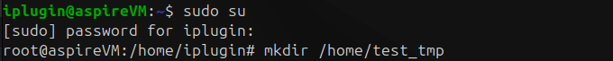

``` Bash
ll /home
```
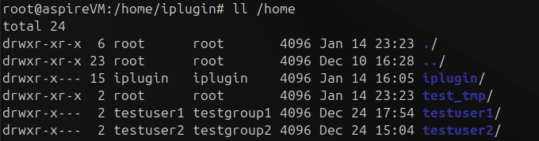

- Set rwx permissions for the owner, group and others to /home/test_tmp
``` Bash
chmod 777 /home/test_tmp
```
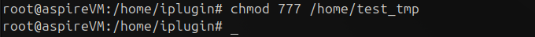

``` Bash
ll /home
```
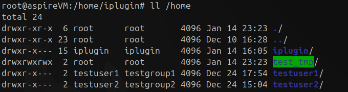

- Create test TEXT files in /home/test_tmp folder with testuser1 permissions
``` Bash
touch /home/test_tmp/test1.txt
chown testuser1:testgroup1 /home/test_tmp/test1.txt
```
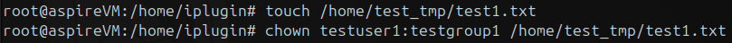

``` Bash
ll /home/test_tmp
```
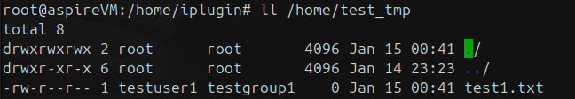

- Create test TEXT files in /home/test_tmp folder with testuser2 permissions
``` Bash
touch /home/test_tmp/test2.txt
chown testuser2:testgroup2 /home/test_tmp/test2.txt
```
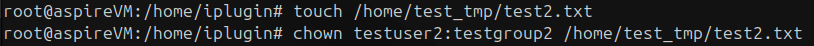

``` Bash
ll /home/test_tmp
```
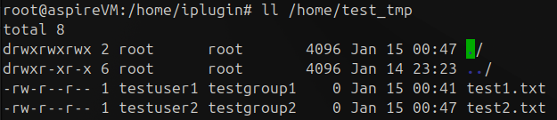

- Block file deletion from this directory by other users
``` Bash
chmod 775 /home/test_tmp
```
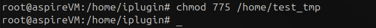

``` Bash
ll /home/test_tmp
```
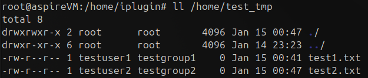

- Try deleting files belonging to testuser1 from the testuser2 account
``` Bash
su testuser2
rm -f /home/test_tmp/test1.txt
```
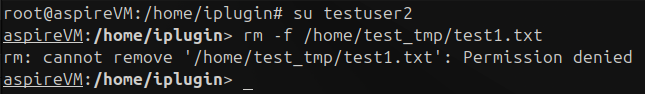

- Allow file deletion from this directory by other users
``` Bash
chmod 777 /home/test_tmp
```
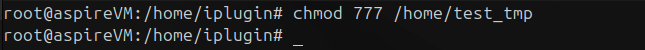

``` Bash
ll /home/test_tmp
```
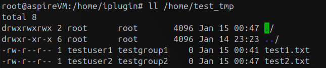

- Try deleting files belonging to testuser1 from the testuser2 account
``` Bash
su testuser2
rm -f /home/test_tmp/test1.txt
```
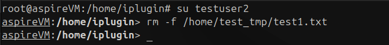

``` Bash
ls -l /home/test_tmp
```


### Verify that SUID bit does not work for executable Shell scripts.
- Create suid_test.sh script from the testuser1 credentials with the following content: “#!/bin/sh whoami”
``` Bash
su testuser1
```
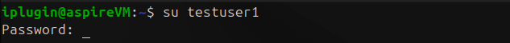

``` Bash
nano /home/test_tmp/suid_test.sh
# Ctrl+O -> Enter -> Ctrl+X
chmod u+s /home/test_tmp/suid_test.sh
```
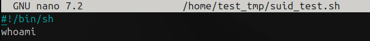

``` Bash
ls -l /home/test_tmp/
```
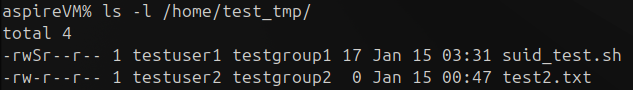

``` Bash
cat /home/test_tmp/suid_test.sh
```
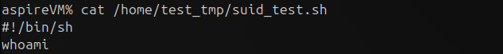

- Set execution bit for everyone
``` Bash
chmod a+x /home/test_tmp/suid_test.sh
```
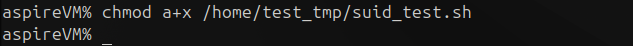

``` Bash
ls -l /home/test_tmp/
```
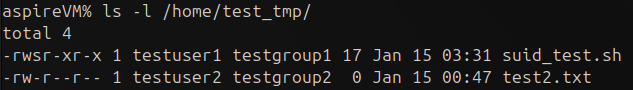


- Try executing test_suid.sh script from different users
``` Bash
whoami # переконатися що я testuser1
/home/test_tmp/suid_test.sh
su testuser2
/home/test_tmp/suid_test.sh
```
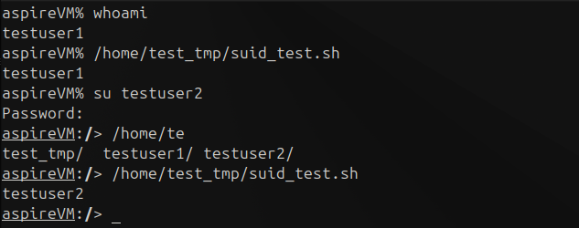

- Try changing UIDs to the different users to test_suid.sh and repeat Item# 3
``` Bash
sudo chown testuser2 /home/test_tmp/suid_test.sh
```
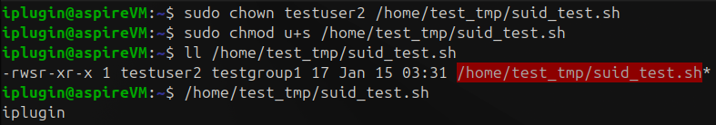

---
**І тут почалося найцікавіше, щоб я не робив воно виконує від імені хто виконує**
**Я пробував активувати suid:**
``` Bash
sudo nano /etc/default/grub
# GRUB_CMDLINE_LINUX_DEFAULT="quiet splash fs.suid_dumpable=1"
sudo update-grub
sudo reboot
##############################
mount | grep "$(df / | tail -1 | awk '{print $1}')"
# Output:
# /dev/sda2 on / type ext4 (rw,relatime)
```
**Все стверджує що має працювати але не працює. А стек овер флов взагалі пише що Bash скрипти не виконуються таким чином**

---

### Adding/Creating New Storage Devices to the Linux OS:
- Add 3x new Disk controllers to the Virtual Machine: SCSI, SAS and NVME(NOTE: Extension pack to VBox must be added in order to use NVME Controllers).
```
VirtualBox -> Settings -> Storage -> Add Controllers: SCSI, SAS, NVMe
```
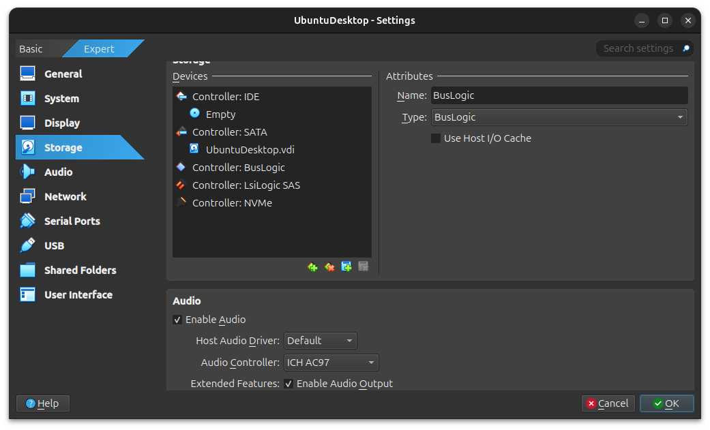

- Add 2xNew HDDs to each of the Disk Controllers (Select VDI, Dynamic Allocation 1Gb size)
```
VirtualBox -> Settings -> Storage -> SCSI -> Add Hard Disk -> Create
```
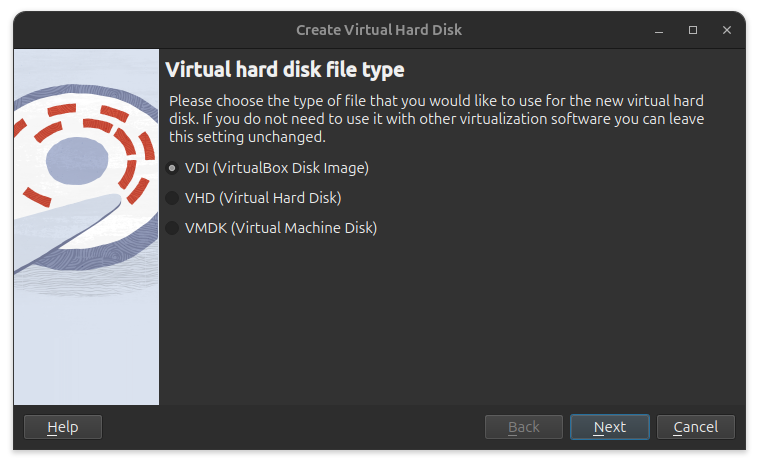

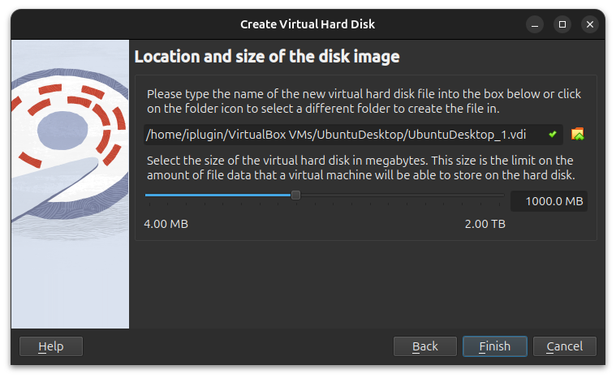

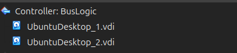


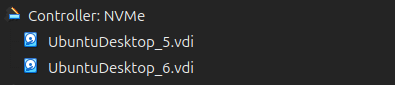

- Verify which device nodes were created in the /dev folder for each of the Drives added.

**Під час завантаження VM в мене викикла помилка**
```
VM Name: UbuntuDesktop

A virtual device is configured in the VM settings but the device implementation is missing.
A possible reason for this error is a missing extension pack. Note that as of VirtualBox 4.0, certain features (for example USB 2.0 support and remote desktop) are only available from an 'extension pack' which must be downloaded and installed separately (VERR_PDM_DEVICE_NOT_FOUND).
Result Code:
NS_ERROR_FAILURE (0x80004005)
Component:
ConsoleWrap
Interface:
IConsole {6ac83d89-6ee7-4e33-8ae6-b257b2e81be8}
```
**Знайшов рішення на [Stackover flow](https://askubuntu.com/questions/453393/virtualbox-fails-with-implementation-of-the-usb-2-0-controller-not-found-after)**

``` Bash
sudo VBoxManage extpack install --replace Oracle_VirtualBox_Extension_Pack-7.1.4.vbox-extpack
sudo VBoxManage extpack cleanup
```

``` Bash
lsblk
```

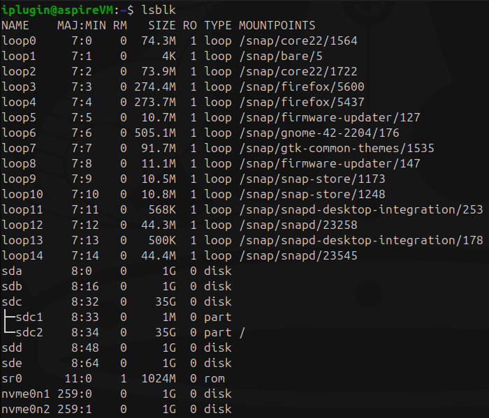

```
SCSI Диски: /dev/sda, /dev/sdb
SAS Диски: /dev/sdd, /dev/sde
NVMe Диски: /dev/nvme0n1, /dev/nvme0n2
```

- Create MBR partition table with a total of 4x partitions similar in size ( 2x Primary and 2x Logical partitions)  for the 1st drive for SCSI and NVME disk controllers using parted utility. (25%, 50%, 75%,100% can be used when specifying partition size)

``` Bash
sudo fdisk /dev/sda
# --------------------------------------------------
# o   create a new empty MBR (DOS) partition table
# n   add a new partition
# p   primary (0 primary, 0 extended, 4 free)
# e   extended (container for logical partitions)
# l   logical (numbered from 5)
# --------------------------------------------------

# Command (m for help): o

# Command (m for help): n
# Select (default p): p
# Partition number (1-4, default 1): 1
# First sector (2048-2097151, default 2048): Enter
# Last sector, (2048-2097151, default 2097151): 523775

# Command (m for help): n
# Select (default p): p
# Partition number (2-4, default 2): 2
# First sector (523776-2097151, default 524288): Enter
# Last sector, (524288-2097151, default 2097151): 1047551

# Command (m for help): n
# Select (default p): e
# Partition number (3,4, default 3): 3
# First sector (523776-2097151, default 1048576): Enter
# Last sector, (1048576-2097151, default 2097151): Enter

# Command (m for help): n
# All space for primary partitions is in use.
# Adding logical partition 5
# First sector (1050624-2097151, default 1050624): Enter
# Last sector, (1050624-2097151, default 2097151): 1569790

# Command (m for help): n
# All space for primary partitions is in use.
# Adding logical partition 6
# First sector (1571839-2097151, default 1572864): Enter
# Last sector, (1572864-2097151, default 2097151): Enter

# Command (m for help): p
# Command (m for help): w
```

``` Bash
sudo fdisk -l /dev/sda
```

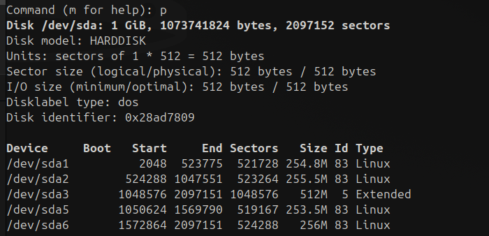

``` Bash
sudo fdisk -l /dev/nvme0n1

# Command (m for help): n
# Select (default p): Enter
# Partition number (1-4, default 1): Enter
# First sector (2048-2097151, default 2048): Enter
# Last sector, (2048-2097151, default 2097151): 523775

# Command (m for help): n
# Select (default p): Enter
# Partition number (2-4, default 2): Enter
# First sector (523776-2097151, default 524288): 523776
# Last sector, (524288-2097151, default 2097151): 1047551

# Command (m for help): n
# Select (default p): e
# Partition number (3,4, default 3): Enter
# First sector (523776-2097151, default 1048576): Enter
# Last sector, (1048576-2097151, default 2097151): Enter

# Command (m for help): n
# All space for primary partitions is in use.
# Adding logical partition 5
# First sector (1050624-2097151, default 1050624): Enter
# Last sector, (1050624-2097151, default 2097151): 1569790

# Command (m for help): n
# All space for primary partitions is in use.
# Adding logical partition 6
# First sector (1571839-2097151, default 1572864): Enter
# Last sector, (1572864-2097151, default 2097151): Enter

# Command (m for help): p
# Command (m for help): w
```

``` Bash
sudo fdisk -l /dev/nvme0n1
```

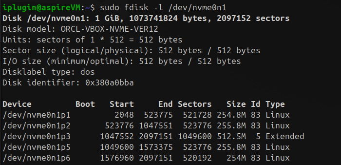


- Create GPT partition table with a total of 4x partitions similar in size for the 2nd drive for SCSI and NVMEdisk controllers using parted utility. (25%, 50%, 75%,100% can be used when specifying partition size).

``` Bash
sudo parted /dev/sdb
# (parted) mklabel
# New disk label type? gpt

# (parted) mkpart primary ext4 0% 25%
# (parted) mkpart primary ext4 25% 50%
# (parted) mkpart primary ext4 50% 75%
# (parted) mkpart primary ext4 75% 100%

# print free
# quit
```

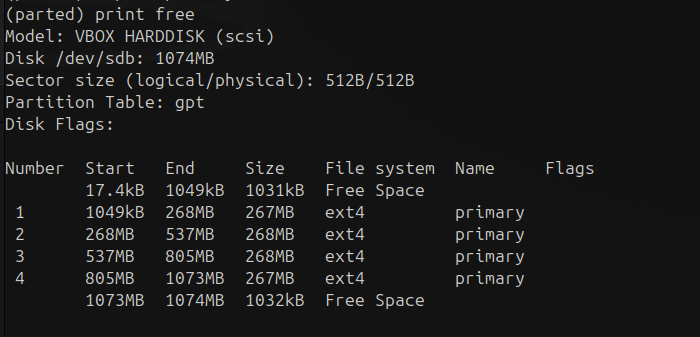


``` Bash
sudo parted /dev/nvme0n2
# (parted) mklabel
# New disk label type? gpt

# (parted) mkpart primary ext4 0% 25%
# (parted) mkpart primary ext4 25% 50%
# (parted) mkpart primary ext4 50% 75%
# (parted) mkpart primary ext4 75% 100%

# print free
# quit
```

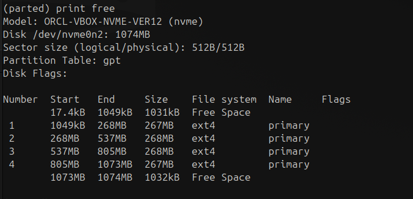

- Create MBR partition table with a total of 4x partitions similar in size ( 2x Primary and 2x Logical partitions)  for the 1st drive for SAS disk controller using fdisk utility

``` Bash
sudo fdisk /dev/sdd
# все те саме скину вже скрін результату
```

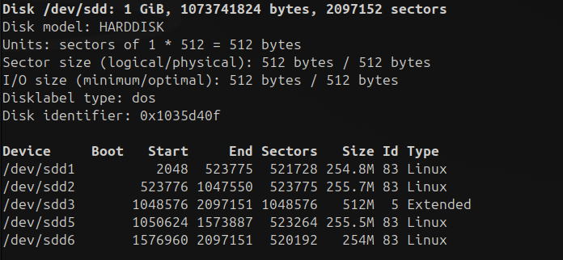

- Create GPT partition table with a total of 4x partitions similar in size for the 2nd drive for SAS disk controller using fdisk utiliy.

``` Bash
sudo parted /dev/sde
# все те саме скину вже скрін результату
lsblk
```

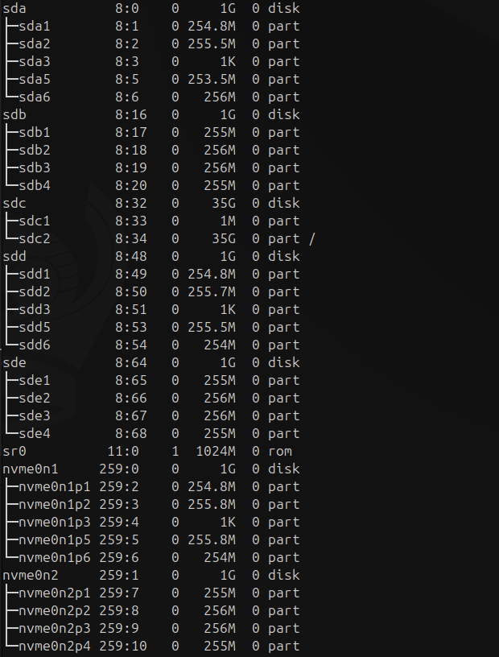

- Compare Partition Table display information using fdisk and parted utilities.

``` Bash
sudo fdisk -l /dev/sda
sudo parted /dev/sda print
```

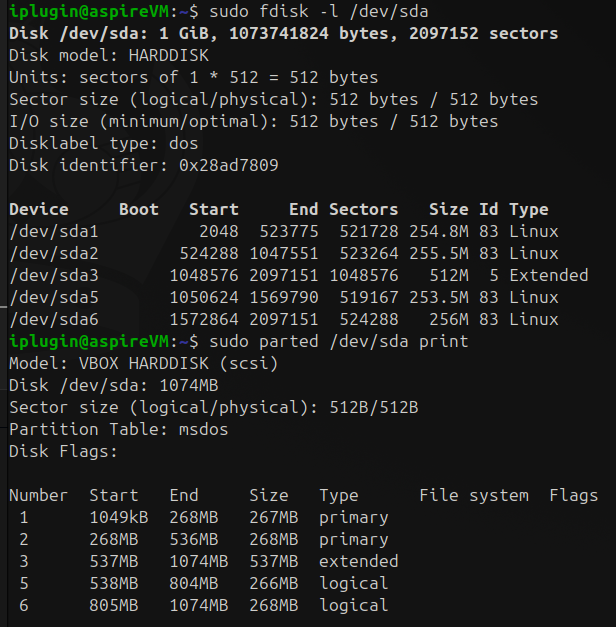

- Verify how disk device nodes were changed in the /dev folder for each of the drives added.

``` Bash
ll /dev
```

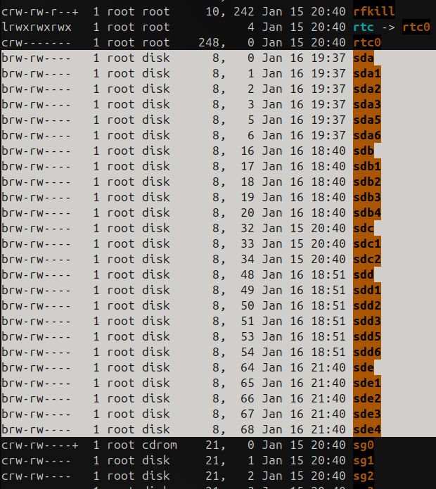

- Create 24x subfolders in the /mnt directory with the following names: nvme0n[12]_ext4, nvme0n[12]_xfs, nvme0n[12]_reiserfs, nvme0n[12]_btrfs, sd[bcde]_ext4, sd[bcde]_xfs, sd[bcde]_reiserfs, sd[bcde]_btrfs.

``` Bash
cd /mnt
sudo mkdir -p /mnt/{nvme0n1,nvme0n2,sdb,sdc,sdd,sde}_{ext4,xfs,reiserfs,btrfs}
```

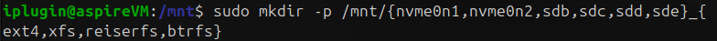

``` Bash
ll
```

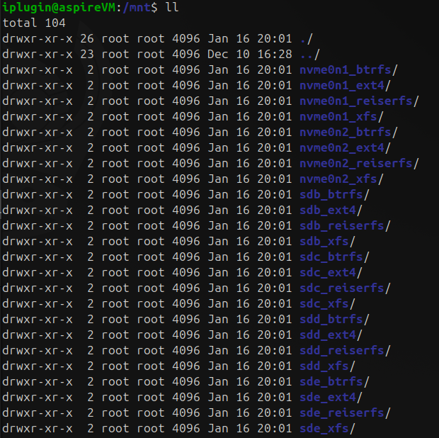

- Create 4x different filesystems per each of the Disk Drives: xfs4, xfs, reiserfs, btrfs using mkfs.* utilities (NOTE:Appropriate FS*progs packages would probably need to be installed in order to get desired utilities for FS creation, follow bash hints in order to get them installed quickly). Use default options for creating FSs.

``` Bash
sudo apt install -y e2fsprogs xfsprogs reiserfsprogs btrfs-progs
```

`e2fsprogs`: для створення файлової системи `ext4`

`xfsprogs`: для створення файлової системи `xfs`

`reiserfsprogs`: для створення файлової системи `reiserfs`

`btrfs-progs`: для створення файлової системи `btrfs`

**Отримав помилку при sudo mkfs.xfs "Filesystem must be larger than 300MB." Сумно...**
**На ось це завдання я витрати дуже багато часу так я почав видаляти 2 остайні створювати заново і я заплутався, а потім в кінці диск sdc вирішив помінятися місцями з sda, якби не скрини я думав що в мене вже здурів**
**Вирішив почати все спочатку і тепер виявляється в мене компютер не баче SAS диски**

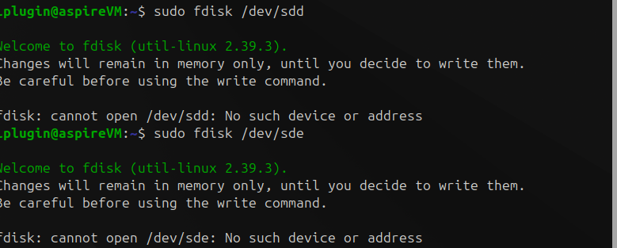

**Я зробив без SAS (sde, sdd) дисків, але нажаль скрінів буде мало я з тим всім забувся їх робити а в мене привичка команду clear використовувати**

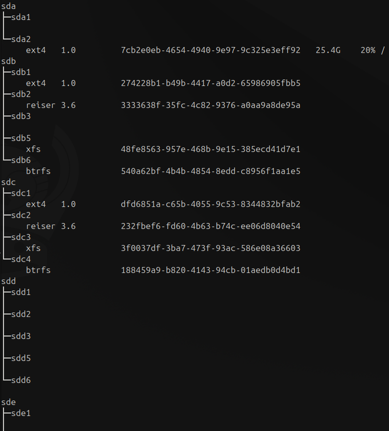

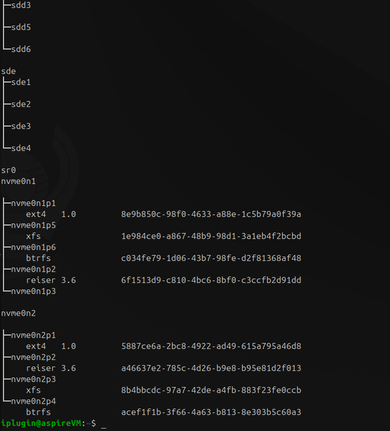

- Mount created disk node devices with created FS to the appropriate folder.

``` Bash
sudo mount /dev/nvme0n2p1 /mnt/nvme0n2_ext4
sudo mount /dev/nvme0n2p2 /mnt/nvme0n2_reiserfs
sudo mount /dev/nvme0n2p3 /mnt/nvme0n2_xfs
sudo mount /dev/nvme0n2p4 /mnt/nvme0n2_btrfs

sudo mount /dev/nvme0n1p1 /mnt/nvme0n1_ext4
sudo mount /dev/nvme0n1p2 /mnt/nvme0n1_reiserfs
sudo mount /dev/nvme0n1p5 /mnt/nvme0n1_xfs
sudo mount /dev/nvme0n1p6 /mnt/nvme0n1_btrfs

sudo mount /dev/sdb1 /mnt/sdb_ext4
sudo mount /dev/sdb2 /mnt/sdb_reiserfs
sudo mount /dev/sdb5 /mnt/sdb_xfs
sudo mount /dev/sdb6 /mnt/sdb_btrfs

sudo mount /dev/sdc1 /mnt/sdc_ext4
sudo mount /dev/sdc2 /mnt/sdc_reiserfs
sudo mount /dev/sdc3 /mnt/sdc_xfs
sudo mount /dev/sdc4 /mnt/sdc_btrfs
```

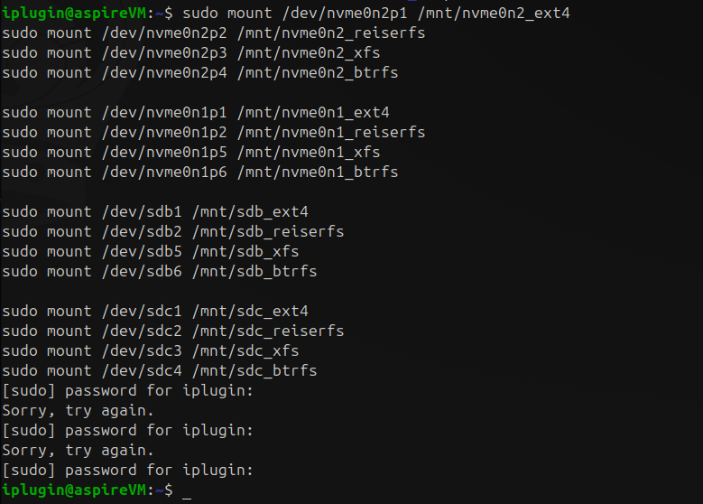

- Evaluate and investigate the system  mount  table and save output somewhere for the later evaluation.

``` Bash
mount
```

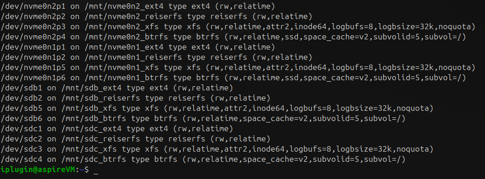

- Investigate available free disk space for each of the filesystems mounted (Also record output to some file for the later evaluation).

``` Bash
df -h
```

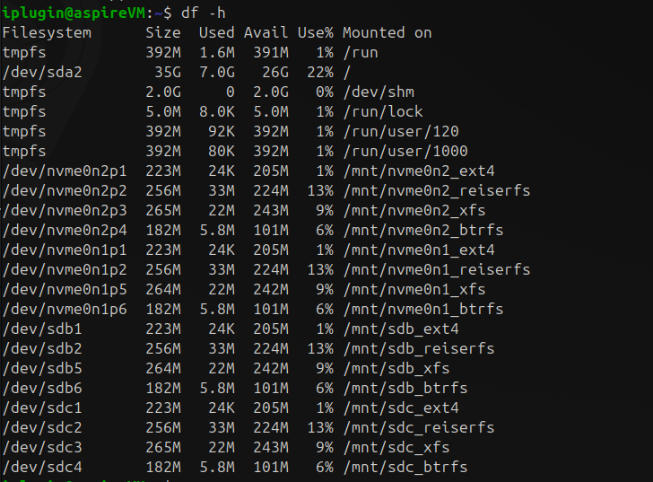