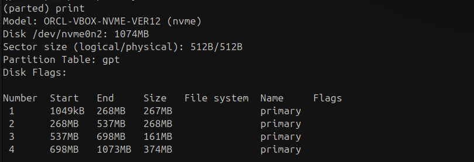

# Homework 5 | `Deadline 15 Jan` | [Presentation](https://github.com/iPlugin/EDUC/blob/main/os_linux/pres/GlobalLogic%20Lec5%20File%20System.pdf)
## Topics in this lecture:
- Filesystems

## Description of the homework
### Adding/Creating New Storage Devices to the Linux OS:
- Add 3x new Disk controllers to the Virtual Machine: SCSI, SAS and NVME(NOTE: Extension pack to VBox must be added in order to use NVME Controllers).
- Add 2xNew HDDs to each of the Disk Controllers (Select VDI, Dynamic Allocation 1Gb size)
- Verify which device nodes were created in the /dev folder for each of the Drives added.
- Create MBR partition table with a total of 4x partitions similar in size ( 2x Primary and 2x Logical partitions)  for the 1st drive for SCSI and NVME disk controllers using parted utility. (25%, 50%, 75%,100% can be used when specifying partition size)
- Create GPT partition table with a total of 4x partitions similar in size for the 2nd drive for SCSI and NVMEdisk controllers using parted utility. (25%, 50%, 75%,100% can be used when specifying partition size).
- Create MBR partition table with a total of 4x partitions similar in size ( 2x Primary and 2x Logical partitions)  for the 1st drive for SAS disk controller using fdisk utility
- Create GPT partition table with a total of 4x partitions similar in size for the 2nd drive for SAS disk controller using fdisk utiliy.
- Compare Partition Table display information using fdisk and parted utilities.
- Verify how disk device nodes were changed in the /dev folder for each of the drives added.
- Create 24x subfolders in the /mnt directory with the following names: nvme0n[12]_ext4, nvme0n[12]_xfs, nvme0n[12]_reiserfs, nvme0n[12]_btrfs, sd[bcde]_ext4, sd[bcde]_xfs, sd[bcde]_reiserfs, sd[bcde]_btrfs.
- Create 4x different filesystems per each of the Disk Drives: xfs4, xfs, reiserfs, btrfs using mkfs.* utilities (NOTE:Appropriate FS*progs packages would probably need to be installed in order to get desired utilities for FS creation, follow bash hints in order to get them installed quickly). Use default options for creating FSs.
- Investigate each FS creation logs and record them somewhere for the later evaluation.
- Mount created disk node devices with created FS to the appropriate folder.
- Evaluate and investigate the system  mount  table and save output somewhere for the later evaluation.
- Investigate available free disk space for each of the filesystems mounted (Also record output to some file for the later evaluation).

## Work in Progress
### Adding/Creating New Storage Devices to the Linux OS:
- Add 3x new Disk controllers to the Virtual Machine: SCSI, SAS and NVME(NOTE: Extension pack to VBox must be added in order to use NVME Controllers).
```
VirtualBox -> Settings -> Storage -> Add Controllers: +SCSI +SAS +NVMe
```


- Add 2xNew HDDs to each of the Disk Controllers (Select VDI, Dynamic Allocation 1Gb size)
```
VirtualBox -> Settings -> Storage -> SCSI -> Add Hard Disk -> Create
```


- Verify which device nodes were created in the /dev folder for each of the Drives added.

---
**Під час завантаження VM в мене викикла помилка**
```
VM Name: UbuntuDesktop

A virtual device is configured in the VM settings but the device implementation is missing.
A possible reason for this error is a missing extension pack. Note that as of VirtualBox 4.0, certain features (for example USB 2.0 support and remote desktop) are only available from an 'extension pack' which must be downloaded and installed separately (VERR_PDM_DEVICE_NOT_FOUND).
Result Code:
NS_ERROR_FAILURE (0x80004005)
Component:
ConsoleWrap
Interface:
IConsole {6ac83d89-6ee7-4e33-8ae6-b257b2e81be8}
```
**Знайшов рішення на [Stackover flow](https://askubuntu.com/questions/453393/virtualbox-fails-with-implementation-of-the-usb-2-0-controller-not-found-after)**

``` Bash
sudo VBoxManage extpack install --replace Oracle_VirtualBox_Extension_Pack-7.1.4.vbox-extpack
sudo VBoxManage extpack cleanup
```
---

``` Bash
lsblk
```


```
SCSI Диски: `/dev/sdd`, `/dev/sde`
SAS Диски: `/dev/sdb`, `/dev/sdc`
NVMe Диски: `/dev/nvme0n1`, `/dev/nvme0n2`
```

- Create MBR partition table with a total of 4x partitions similar in size ( 2x Primary and 2x Logical partitions)  for the 1st drive for SCSI and NVME disk controllers using parted utility. (25%, 50%, 75%,100% can be used when specifying partition size)
```
Однакового розміру свторювати не буду так як знаю що файлова система xfs вимагає 300МБ+, а 1ГБ / 4 = 250МБ
```
```
--------------------------------------------------
o   create a new empty MBR (DOS) partition table
n   add a new partition
p   primary (0 primary, 0 extended, 4 free)
e   extended (container for logical partitions)
l   logical (numbered from 5)
--------------------------------------------------
```

``` Bash
sudo parted /dev/sdd
# (parted) mklabel
# (parted) msdos
# (parted) mkpart primary 0% 25%
# (parted) mkpart primary 25% 50%                                           
# (parted) mkpart extended 50% 100%                                         
# (parted) mkpart logical 50% 65%                                         
# (parted) mkpart logical 65% 100% 
# (parted) print
# (parted) quit
```


``` Bash
sudo parted /dev/nvme0n1
# (parted) mklabel
# (parted) msdos
# (parted) mkpart primary 0% 25%
# (parted) mkpart primary 25% 50%                                           
# (parted) mkpart extended 50% 100%                                         
# (parted) mkpart logical 50% 65%                                         
# (parted) mkpart logical 65% 100% 
# (parted) print
# (parted) quit
```


- Create GPT partition table with a total of 4x partitions similar in size for the 2nd drive for SCSI and NVMEdisk controllers using parted utility. (25%, 50%, 75%,100% can be used when specifying partition size).

``` Bash
sudo parted /dev/sde
# (parted) mklabel
# (parted) gpt
# (parted) mkpart primary 0% 25%
# (parted) mkpart primary 25% 50%                                        
# (parted) mkpart primary 50% 65%                                         
# (parted) mkpart primary 65% 100% 
# (parted) print
# (parted) quit
```


``` Bash
sudo parted /dev/nvme0n2
# (parted) mklabel
# (parted) gpt
# (parted) mkpart primary 0% 25%
# (parted) mkpart primary 25% 50%                                        
# (parted) mkpart primary 50% 65%                                         
# (parted) mkpart primary 65% 100% 
# (parted) print
# (parted) quit
```



- Create MBR partition table with a total of 4x partitions similar in size ( 2x Primary and 2x Logical partitions)  for the 1st drive for SAS disk controller using fdisk utility

``` Bash
sudo fdisk /dev/sdb
# Command (m for help): n
# Select (default p): p
# Partition number (1-4, default 1): 1
# First sector: 2048
# Last sector: 523000
# ---------------------
# Command (m for help): n
# Select (default p): p
# Partition number (1-4, default 2): 2
# First sector: 524288
# Last sector: 1046000
# ---------------------
# Command (m for help): n
# Select (default p): e
# Partition number (1-4, default 3): 3
# First sector: 1046528
# Last sector: 2097151
# ---------------------
# Command (m for help): n
# First sector: 1048576
# Last sector: 1205000
# ---------------------
# Command (m for help): n
# First sector: 1208320
# Last sector: 2097151
# ---------------------
# Command (m for help): p
# Command (m for help): w
```


- Create GPT partition table with a total of 4x partitions similar in size for the 2nd drive for SAS disk controller using fdisk utiliy.

``` Bash
sudo fdisk /dev/sdc
# Command (m for help): g
# Command (m for help): n
# Partition number (1-128, default 1): 1
# First sector: 2048
# Last sector: 523000
# ---------------------
# Command (m for help): n
# Partition number (2-128, default 2): 2 
# First sector: 524288
# Last sector: 1046000
# ---------------------
# Command (m for help): n
# Partition number (3-128, default 3): 3
# First sector: 1046528
# Last sector: 1205000
# ---------------------
# Command (m for help): n
# Partition number (4-128, default 4): 4
# First sector: 1206272
# Last sector: 2095103
# ---------------------
# Command (m for help): p
# Command (m for help): w
```


- Compare Partition Table display information using fdisk and parted utilities.

``` Bash
sudo fdisk -l /dev/sdc
```


``` Bash
sudo parted /dev/sde print
```


- Verify how disk device nodes were changed in the /dev folder for each of the drives added.

``` Bash
ll /dev
```


- Create 24x subfolders in the /mnt directory with the following names: nvme0n[12]_ext4, nvme0n[12]_xfs, nvme0n[12]_reiserfs, nvme0n[12]_btrfs, sd[bcde]_ext4, sd[bcde]_xfs, sd[bcde]_reiserfs, sd[bcde]_btrfs.

``` Bash
sudo mkdir -p /mnt/{nvme0n1,nvme0n2,sdb,sdc,sdd,sde}_{ext4,xfs,reiserfs,btrfs}
```


``` Bash
ll /mnt
```


- Create 4x different filesystems per each of the Disk Drives: xfs4, xfs, reiserfs, btrfs using mkfs.* utilities (NOTE:Appropriate FS*progs packages would probably need to be installed in order to get desired utilities for FS creation, follow bash hints in order to get them installed quickly). Use default options for creating FSs.

`e2fsprogs`: для створення файлової системи `ext4`

`xfsprogs`: для створення файлової системи `xfs`

`reiserfsprogs`: для створення файлової системи `reiserfs`

`btrfs-progs`: для створення файлової системи `btrfs`

``` Bash
sudo apt install -y e2fsprogs xfsprogs reiserfsprogs btrfs-progs
```


#### Для SCSI дисків:


``` Bash
sudo mkfs.ext4 /dev/sdd1
sudo mkfs.btrfs /dev/sdd2
sudo mkfs.reiserfs /dev/sdd5
sudo mkfs.xfs /dev/sdd6
```


``` Bash
sudo mkfs.ext4 /dev/sde1
sudo mkfs.btrfs /dev/sde2
sudo mkfs.reiserfs /dev/sde3
sudo mkfs.xfs /dev/sde4
```

``` Bash
lsblk -f
```


#### Для SAS дисків:


``` Bash
sudo mkfs.ext4 /dev/sdb1
sudo mkfs.btrfs /dev/sdb2
sudo mkfs.reiserfs /dev/sdb5
sudo mkfs.xfs /dev/sdb6
```


``` Bash
sudo mkfs.ext4 /dev/sdc1
sudo mkfs.btrfs /dev/sdc2
sudo mkfs.reiserfs /dev/sdc3
sudo mkfs.xfs /dev/sdc4
```

``` Bash
lsblk -f
```

**Я вже цю домашку переробляю другий раз і я не розумію чому так але впевний момент часу диски міняються місцями sda -> sdc і не тільки вони... Я довго мучився і зрозумів що проблема в SAS дисках. Попередній раз вони помінялися місцями з sdc і я видалив головний свій диск. Тому перестановлював віртуальну і перероблював всі дз. Можете помітити по username@hostname**


#### Для NVMe дисків:


``` Bash
sudo mkfs.ext4 /dev/nvme0n1p1
sudo mkfs.btrfs /dev/nvme0n1p2
sudo mkfs.reiserfs /dev/nvme0n1p5
sudo mkfs.xfs /dev/nvme0n1p6
```


``` Bash
sudo mkfs.ext4 /dev/nvme0n2p1
sudo mkfs.btrfs /dev/nvme0n2p2
sudo mkfs.reiserfs /dev/nvme0n2p3
sudo mkfs.xfs /dev/nvme0n2p4
```

``` Bash
lsblk -f
```
- Mount created disk node devices with created FS to the appropriate folder.

``` Bash
sudo mount /dev/nvme0n2p1 /mnt/nvme0n2_ext4
sudo mount /dev/nvme0n2p2 /mnt/nvme0n2_btrfs   
sudo mount /dev/nvme0n2p3 /mnt/nvme0n2_reiserfs
sudo mount /dev/nvme0n2p4 /mnt/nvme0n2_xfs  

sudo mount /dev/nvme0n1p1 /mnt/nvme0n1_ext4
sudo mount /dev/nvme0n1p2 /mnt/nvme0n1_btrfs   
sudo mount /dev/nvme0n1p5 /mnt/nvme0n1_reiserfs
sudo mount /dev/nvme0n1p6 /mnt/nvme0n1_xfs  

sudo mount /dev/sdb1 /mnt/sdb_ext4
sudo mount /dev/sdb2 /mnt/sdb_btrfs   
sudo mount /dev/sdb3 /mnt/sdb_reiserfs
sudo mount /dev/sdb4 /mnt/sdb_xfs  

sudo mount /dev/sda1 /mnt/sdc_ext4
sudo mount /dev/sda2 /mnt/sdc_btrfs   
sudo mount /dev/sda5 /mnt/sdc_reiserfs
sudo mount /dev/sda6 /mnt/sdc_xfs
```

- Evaluate and investigate the system  mount  table and save output somewhere for the later evaluation.

``` Bash
lsblk
```


- Investigate available free disk space for each of the filesystems mounted (Also record output to some file for the later evaluation).

``` Bash
df -h
```

