# Homework 6 | `Deadline 21 January`
## Topics in this lecture:
- cut - remove sections from each line of files
- tr - translate or delete characters
- sort - sort lines of text files
- sed - stream editor for filtering and
transforming text
- awk - pattern scanning and
processing language
- grep - print lines matching a
pattern


## Description of the homework:
### Format output with cut:
- Reformat an output from arp(-a -n) utility in the following format: “IP MAC Interface” using cut utility.
- Printout existing users’s shells in the following format: “username:shell”

### Format output with cut/tr:
- Printout existing users’s shells in the following format:“username=shell”
- Printout user names of the users with the real shells in uppercase

### Format output with tr/sort/cut:
- Printout all system users names in the reverse UID order (bigger UID on top).
- Printout current user’s home directory file space usage using “du” utility in the reverse order (bigger file sizes on top).

### Format output with sed:
- Printout all system users with existing shells using sed and substitute colons(”:”) with dashes (“-”). 
- Create a sample regular version.txt file and write an output of the following command to that file: “lsb_release -a”. Add a new line containing the word “Linux” using “sed” before the line starting with “Release:...” keyword.
- Get list of all usernames from /etc/passwd using sed.
- Remove commented lines from the user’s bash profile.
- Remove duplicate lines from the user’s bash profile.
- Removing all commented lines, empty lines and duplicate lines from the user’s bash profile.

### Format output with awk:
- Displays the number of lines in the created above version.txt file using awk.
- Printout current user’s home directory file space usage in 1K blocks using “du” utility and calculate the sum using awk.
- Printout current user’s home directory file space usage in 1K blocks using “du” utility and calculate the average of the values using awk.
- Print the lines between “Distributor ID:” and “Codename:” in a version.txt file using awk.


## Work in Progress
### Format output with cut:
- Reformat an output from arp(-a -n) utility in the following format: “IP MAC - Interface” using cut utility.
``` Bash
arp -a -n
```

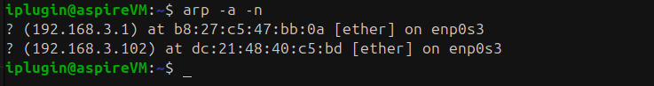

``` Bash
arp -a -n | cut -d' ' -f2,4,5
```

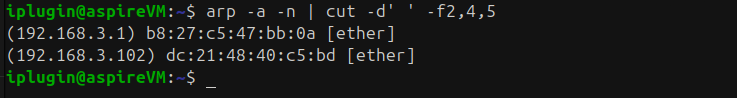

- Printout existing users’s shells in the following format: “username:shell”
``` Bash
cat /etc/passwd
```

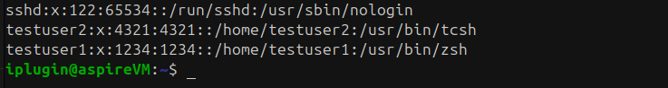

``` Bash
cut -d':' -f1,7 /etc/passwd
```

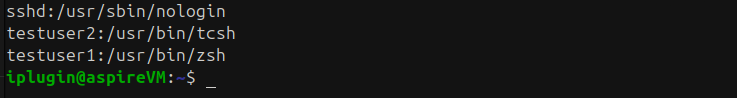

### Format output with cut/tr:
- Printout existing users’s shells in the following format:“username=shell”
``` Bash
cat /etc/passwd
```


``` Bash
cut -d':' -f1,7 /etc/passwd | tr ':' '='
```

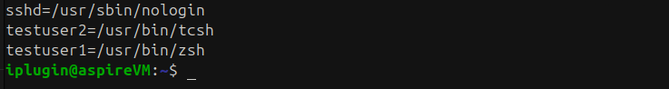

- Printout user names of the users with the real shells in uppercase
``` Bash
cat /etc/passwd
```


``` Bash
cut -d':' -f1,7 /etc/passwd | tr '[a-z]' '[A-Z]'
```

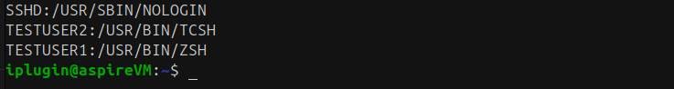

### Format output with tr/sort/cut:
- Printout all system users names in the reverse UID order (bigger UID on top).
``` Bash
cat /etc/passwd
```

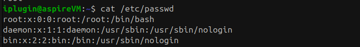

``` Bash
cut -d: -f1,3 /etc/passwd | sort -t: -k2 -n -r | cut -d: -f1
```

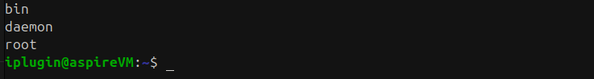

- Printout current user’s home directory file space usage using “du” utility in the reverse order (bigger file sizes on top).
``` Bash
du
```

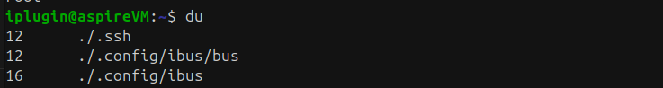

``` Bash
du -a -h ~ | sort -r -h
```


### Format output with sed:
- Printout all system users with existing shells using sed and substitute colons(”:”) with dashes (“-”). 
``` Bash
cat /etc/passwd
```


``` Bash
sed -n '/\/bin\//s/:/-/gp' /etc/passwd
# Команда важка тому хочу пояснити що я її розумію а не просто взяв з інтернету
# sed - для редагування виводу
# -n - вимикає автоматичний друк всіх рядків
# /.../.../ - шаблон а так як в тому шаблоні має бути присутнє / то ми його екрануємо за допомгою \ тому і вийшло /\/
# також s/old/new/g - шаблон для підміни ':' -> '-' 
# p явно вказує які саме рядки слід друкувати
```

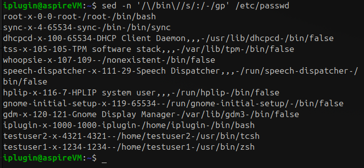

- Create a sample regular version.txt file and write an output of the following command to that file: “lsb_release -a”. Add a new line containing the word “Linux” using “sed” before the line starting with “Release:...” keyword.

``` Bash
cd /home/test_tmp/
lsb_release -a > version.txt
cat version.txt
```

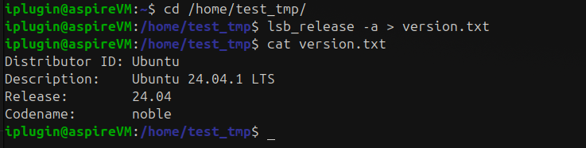

``` Bash
sed -i '/^Release:/i Linux' version.txt
# -i - безпосередню міняє в файлі
# /i - може відкрити файл
cat version.txt
```

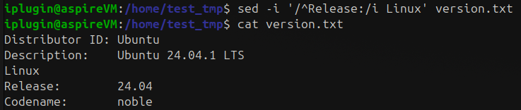

- Get list of all usernames from /etc/passwd using sed.
``` Bash
cat /etc/passwd
```


``` Bash
sed 's/:.*/ /g' /etc/passwd
# :весь зміст -> перетвореємо на нічого
```

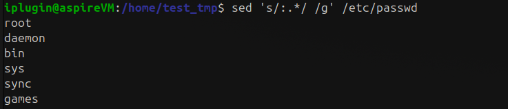

- Remove commented lines from the user’s bash profile.
``` Bash
cat .profile
```

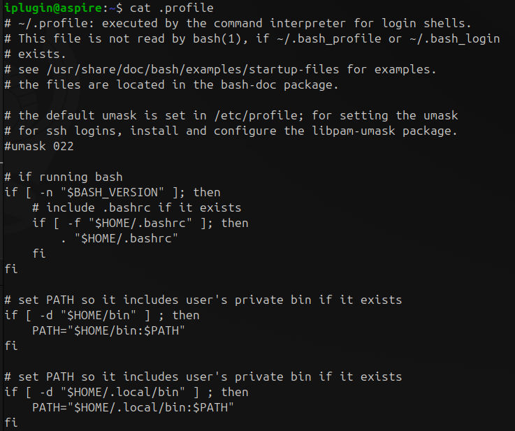

``` Bash
sed '/^#/d' .profile
```

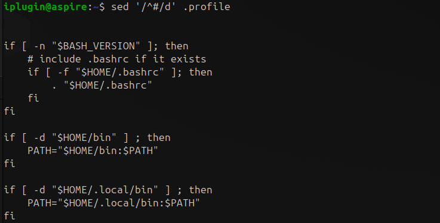

- Remove duplicate lines from the user’s bash profile.

Знайшов цю команду на [StackOverFlow](https://stackoverflow.com/questions/65238579/remove-duplicate-lines-based-on-starting-pattern-using-bash), але в даному файлі `.profile`
нічого не помінялося тому створюю `test.txt` задам вміст і використаю команду ще раз

``` Bash
nano test.txt
```

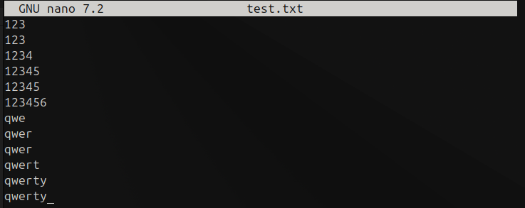

``` Bash
sed '$!N; /^\(.*\)\n\1$/!P; D' test.txt
```

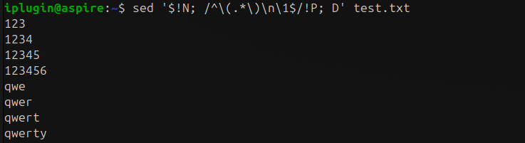


- Removing all commented lines, empty lines and duplicate lines from the user’s bash profile.

Знайшов цю команду на [StackOverFlow](https://unix.stackexchange.com/questions/76061/can-sed-remove-successive-newline-characters)

``` Bash
nano test.txt
```

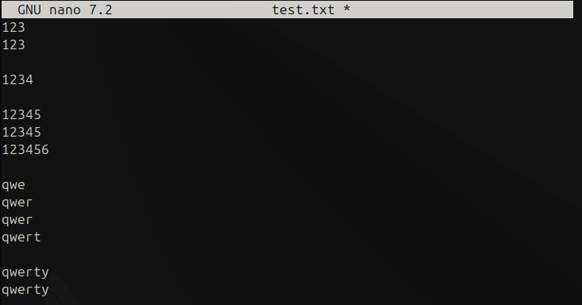

``` Bash
sed '$!N; /^\(.*\)\n\1$/!P; D' test.txt | sed '/^$/d'
```

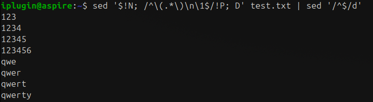

### Format output with awk:
- Displays the number of lines in the created above version.txt file using awk.

``` Bash
cat /home/test_tmp/version.txt
```

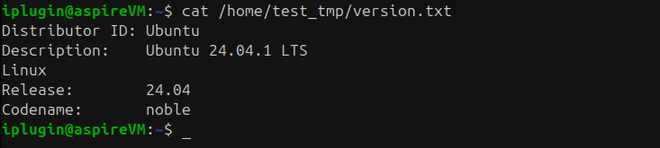

``` Bash
awk 'END {print NR}' /home/test_tmp/version.txt
```

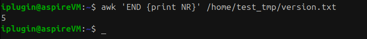

- Printout current user’s home directory file space usage in 1K blocks using “du” utility and calculate the sum using awk.
``` Bash
du -s -k ~
```


``` Bash
du -s -k ~ | awk '{print $1}'
```


- Printout current user’s home directory file space usage in 1K blocks using “du” utility and calculate the average of the values using awk.
``` Bash
du -k ~/*
```

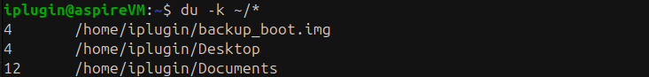

``` Bash
du -k ~/* | awk '{sum += $1; count++} END {if (count > 0) print sum / count; else print 0}'
```

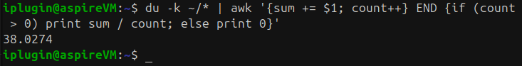

- Print the lines between “Distributor ID:” and “Codename:” in a version.txt file using awk.

Знайшов цю команду на [StackOverFlow](https://unix.stackexchange.com/questions/739286/awk-print-lines-between-two-patterns-only-need-to-print-last-occurrence-of-matc) і ще трохи додумав своє

``` Bash
cat /home/test_tmp/version.txt
```


``` Bash
awk '/Distributor ID:/, /Codename:/ { if ($0 !~ /^Codename:/ && $0 !~ /^Distributor ID:/) print }' /home/test_tmp/version.txt
```

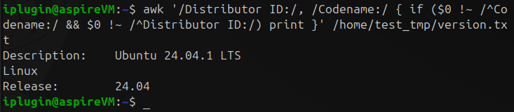