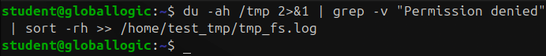
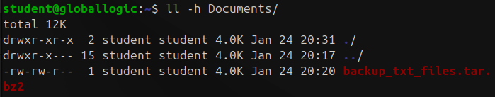

# Homework 7 | `Deadline 24 January` | Other useful information
## Topics in this lecture:
- hexdump
- lsof
- ulimit
- ps
- top
- syslog
- dmesg
- monitoring
- wget, curl
- crond
- archives

## Description of the homework
### 1st Hexdump Task:
- Find video.ko kernel module in the /lib/modules directory
- Find “srcversion” parameter printable character in the video.ko module using strings app and display it’s value (Should be 23 SYMBOLS value, smth like: srcversion=2D9D445995948D3E5DC8486)
- Find an offset of the srcversion parameter value using hexdump(2D9D445995948D3E5DC8486 in the current example).
- Print srcversion value using hexdump in a human readable form (use appropriate offset, length and formatting (-e) option).
- Provide snapshots of CLI with the results and hexdump options used.

### 2nd Hexdump Task:
- Print “Linux” word in a HEX representation using hexdump in the following format: 0xAA 0xAA…
- Do the same with hexdump + sed combination.

### lsof Task:
- Display all open files for the current shell process using a special variable for the PID specification

### Cron task:
- Create a cronjob for the current user which will run each odd day of the month  at 00:12 and do the following:
    - Analyze file sizes in the /tmp directory by displaying each file size in descending order.
    - The results of the analysis must be recorded to the current user home directory/log subfolder, tmp_fs.log
    - The results of the analysis should be appended to the tmp_fs.log, and not be overridden.
- Create a new logrotate task which will perform tmp_fs.log rotation using the following rules:
    - Log file must be rotated 7 times and only if it grows bigger than 150K.
    - Rotated log file must be compressed

### Archive Task
- Find all *txt files in the user’s home directory and create an _txt_files.tar archive.
- Compress created archive using bzip2 compressing utility with the maximum compression level.
- Try to combine finding + archiving + compressing.
- Compress created archive using gzip and zip compressors.
- Compare original txt_files.tar archive size and compressed archive size compressed with the different compressors.

## Work in Progress
### 1st Hexdump Task:
- Find video.ko kernel module in the /lib/modules directory
``` Bash
cd /lib/modules
find . -name video.*
```


- Find “srcversion” parameter printable character in the video.ko module using strings app and display it’s value (Should be 23 SYMBOLS value, smth like: srcversion=2D9D445995948D3E5DC8486)

``` Bash
cd /lib/modules/6.8.0-51-generic/kernel/drivers/acpi/
sudo unzstd -d video.ko.zst -o video.ko
ll
```


``` Bash
sudo apt install binutils
strings video.ko | grep srcversion
```


- Find an offset of the srcversion parameter value using hexdump(2D9D445995948D3E5DC8486 in the current example).

``` Bash
hexdump -C video.ko | grep 'EB6C97E98230'
```


```
0000c370  6f 20 44 75 63 72 6f 74  00 73 72 63 76 65 72 73  |o Ducrot.srcvers|
0000c380  69 6f 6e 3d 45 42 36 43  39 37 45 39 38 32 33 30  |ion=EB6C97E98230|
0000c390  42 42 45 31 32 31 33 37  35 33 35 00 61 6c 69 61  |BBE12137535.alia|
```

- Print srcversion value using hexdump in a human readable form (use appropriate offset, length and formatting (-e) option).

``` Bash
# так як наше значення починається після "ion="
# я можу +4 байти = 0000c384 -> 0xC384
hexdump -s 0xC384 -n 23 -e '23/1 "%c"' video.ko
```


### 2nd Hexdump Task:
- Print “Linux” word in a HEX representation using hexdump in the following format: 0xAA 0xAA…

``` Bash
echo -n "Linux" | hexdump -v -e '/1 "0x%02X "'; echo
# добавив ще ; echo для гарнішого виводу в термінал
```


- Do the same with hexdump + sed combination.

``` Bash
echo "Hello World" | hexdump -v -e '1/1 "%c"' | sed 's/ /_/g'
# я щось іншого не міг придумати 
```


### lsof Task:
- Display all open files for the current shell process using a special variable for the PID specification
**НЕ впевнений що правильно зрозумів завдання**
``` Bash
lsof -p $$
# можна було ще 
PID=$$
lsof -p $PID
# але то то саме
```


### Cron task:
- Create a cronjob for the current user which will run each odd day of the month  at 00:12 and do the following:

``` Bash
du -ah /tmp 2>&1 | grep -v "Permission denied" | sort -rh >> ~/log/tmp_fs.log
# команда може виглядати складною якщо треба буде я можу пояснити що я її розумію
```



``` Bash
cat /home/test_tmp/tmp_fs.log
```


    - Analyze file sizes in the /tmp directory by displaying each file size in descending order.
    - The results of the analysis must be recorded to the current user home directory/log subfolder, tmp_fs.log
    - The results of the analysis should be appended to the tmp_fs.log, and not be overridden.

``` Bash
crontab -e
# 12 0 1-31/2 * * du -ah /tmp 2>&1 | grep -v "Permission denied" | sort -rh >> ~/log/tmp_fs.log
crontab -l
```


- Create a new logrotate task which will perform tmp_fs.log rotation using the following rules:
    - Log file must be rotated 7 times and only if it grows bigger than 150K.
    - Rotated log file must be compressed

``` Bash
sudo nano /etc/logrotate.d/tmp_fs
```


``` Bash
dd if=/dev/zero of=/home/test_tmp/tmp_fs.log bs=1K count=160
# хочу штучно викликати ротацію
```


``` Bash
sudo logrotate -f /etc/logrotate.d/tmp_fs
# error: skipping "/home/test_tmp/tmp_fs.log" because parent directory has insecure permissions (It's world writable or writable by group which is not "root") Set "su" directive in config file to tell logrotate which user/group should be used for rotation.
sudo chmod 755 /home/test_tmp/
```


``` Bash
sudo logrotate -f /etc/logrotate.d/tmp_fs
ll -h /home/test_tmp/
```


### Archive Task
- Find all *txt files in the user’s home directory and create an _txt_files.tar archive.

``` Bash
tar -cvf ~/Documents/backup_txt_files.tar $(find ~ -type f -name "*.txt")
# Ще можна було таке в cron добавити щось типу такого
# 0 3 * * * tar -cvf ~/Documents/backup_txt_files_$(date +\%F).tar $(find ~ -type f -name "*.txt")

```


``` Bash
ll Documents/
```


- Compress created archive using bzip2 compressing utility with the maximum compression level.

``` Bash
ll -h Documents/ # хочу зафіксувати память
```


``` Bash
sudo apt install bzip2
```


``` Bash
bzip2 -9 ~/Documents/backup_txt_files.tar
```


``` Bash
ll -h Documents/
```



- Try to combine finding + archiving + compressing.

``` Bash
tar -cvjf ~/Documents/backup_txt_files2.tar.bz2 $(find ~ -type f -name "*.txt")
```


``` Bash
ll -h Documents/
```


- Compress created archive using gzip and zip compressors.

``` Bash
tar -cvf ~/Documents/backup_txt_files3.tar $(find ~ -type f -name "*.txt")
gzip -9 ~/Documents/backup_txt_files3.tar
```


``` Bash
ll -h Documents/
```


``` Bash
tar -cvf ~/Documents/backup_txt_files4.tar $(find ~ -type f -name "*.txt")
zip -9 ~/Documents/backup_txt_files4.zip ~/Documents/backup_txt_files4.tar
```


``` Bash
ll -h Documents/
```


- Compare original txt_files.tar archive size and compressed archive size compressed with the different compressors.

``` Bash
ll -h ~/Documents/ | sort -k 5 -hr
```

