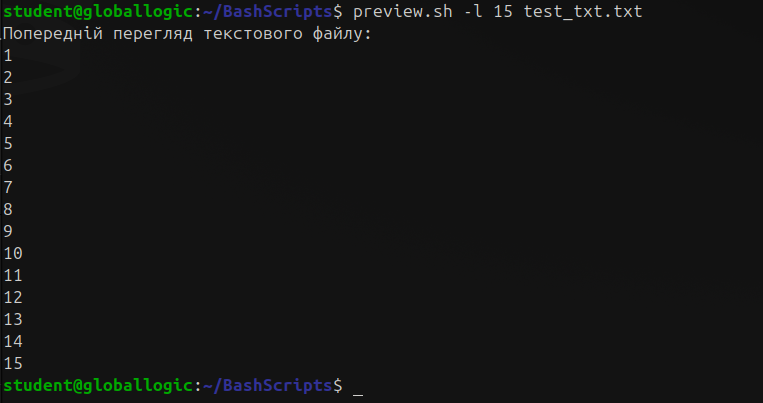

# Homework 8 | `Deadline 28 January` | [Presentation](https://github.com/iPlugin/EDUC/blob/main/os_linux/pres/GlobalLogic%20Lec8%20Bash%20Scripting.pdf)
## Topics in this lecture:
- Conditional statements (if, then else, case)
- Variables
- Evaluations
- string operations in bash
- Bash command substitution
- Functions
- Parameters
- Basic Bash commands (echo, read, etc.)

## Description of the homework
### “Preview script”
Implement a simple script that prints a “preview” of selected file contents when used as: $ preview filename. With PREVIEW_LENGTH=<n> and -l <n> to limit the number of lines printed. Required output formats determined automatically select file:
- List of files inside tarball
- Highlighted source code in bash, C, optionally other programming languages
- Configuration and data formats as is or with highlighting
- Canonical hex+ASCII display of PIE executables
- Other files as is

### “Validity script”
- Create a script which accepts 1x arguments: arg1 = command name or PATH.
- Verifies that a specified program is either valid as is or can be found in the PATH directory list Given a command and the PATH, tries to find the command. Returns 0 if found and executable; 1 if not.

### “Str_validation script”
- Create a script which ensures that input consists only of alphabetical and numeric characters Script must ask user yo enter validation string  and return whether input is Valid or not valid

## Work in Progress
### “Preview script”
Implement a simple script that prints a “preview” of selected file contents when used as: $ preview filename. With PREVIEW_LENGTH=<n> and -l <n> to limit the number of lines printed. Required output formats determined automatically select file:
- List of files inside tarball
- Highlighted source code in bash, C, optionally other programming languages
- Configuration and data formats as is or with highlighting
- Canonical hex+ASCII display of PIE executables
- Other files as is

``` Bash
touch preview.sh
chmod +x preview.sh
nano preview.sh
```


``` Bash
#!/bin/bash

# Виставляємо по дефолту 10 якщо не було виставлено l
PREVIEW_LENGTH=10

# Меню помічник
helper() {
  echo ""
  echo "         ▐███████▌         "
  echo "         ▐       ▌         "
  echo "   ▄▀▀▀█ ▐ ▀▀▄▀▀ ▌ █▀▀▀▄   "
  echo "   ▌▌▌▌▐ ▄▌ ▄▄▄ ▐▄ ▌▐▐▐▐   "
  echo "+------------------------- "
  echo "| Привіт я твій помічник"
  echo "| Виводжу попередній вивід інформації"
  echo "| $ $0 -l <number_of_lines> <filename>"
  exit 1
}


# Витягуємо аргументи з команди і аналізуємо
while getopts ":l:" opt; do
  case $opt in
    l) # Ставимо + в ^[0-9]+$ щоб кожне число перевірило
      if [[ $OPTARG =~ ^[0-9]+$ ]]; then
        PREVIEW_LENGTH=$OPTARG
      else
        echo "Помилка: -l прапорець має бути числом"
        helper
      fi
      ;;
    *) # Якщо не l виводи меню правильного запиту
      helper
      ;;
  esac
  shift $((OPTIND - 1))
  OPTIND=1
done

# Провіряємо чи користувач прикріпив файл до команди
if [ "$#" -ne 1 ]; then
  helper
fi

# Якщо прикріпив то присвоюємо змінній FILENAME
FILENAME=$1


# Логіка обробки файлів
if file "$FILENAME" | grep -q "gzip compressed data"; then
  # Якщо це tar.gz архів, вивести список файлів
  echo "Список файлів у архіві:"
  tar -tf "$FILENAME"

elif file "$FILENAME" | grep -q "ASCII text"; then
  # Якщо це текстовий файл, вивести перші рядки
  echo "Попередній перегляд текстового файлу:"
  head -n "$PREVIEW_LENGTH" "$FILENAME"

elif file "$FILENAME" | grep -q "ELF"; then
  # Якщо це виконуваний файл ELF, показати вміст у форматі hex+ASCII
  echo "HEX+ASCII вміст ELF-файлу:"
  xxd "$FILENAME" | head -n "$PREVIEW_LENGTH"

else
  # Для інших типів файлів
  head -n "$PREVIEW_LENGTH" "$FILENAME"
fi
```


``` Bash
sudo mv preview.sh /usr/bin/
nano test_txt.txt
# Файл щоб показати що все працює
```


``` Bash
nano tmp_bash.sh
# Архів щоб показати що все працює
```


``` Bash
ll
```


``` Bash
# Починаю тестувати
preview.sh
```


``` Bash
preview.sh -l 5 test_txt.txt
```


``` Bash
preview.sh -l 15 test_txt.txt
```



``` Bash
preview.sh -l 7 /usr/bin/bash
```


``` Bash
preview.sh testarchive.tar.gz
```


**Можна було ще робити не через if else а через case**


### “Validity script”
- Create a script which accepts 1x arguments: arg1 = command name or PATH.
- Verifies that a specified program is either valid as is or can be found in the PATH directory list Given a command and the PATH, tries to find the command. Returns 0 if found and executable; 1 if not.

``` Bash
touch validity.sh
chmod +x validity.sh
nano validity.sh
```


``` Bash
./validity.sh echo
./validity.sh ll
./validity.sh ls
./validity.sh bash
./validity.sh preview
./validity.sh preview.sh
```


**Доречі ще можна було через IFS попробувати але мені щось воно не сподобалося**


### “Str_validation script”
- Create a script which ensures that input consists only of alphabetical and numeric characters Script must ask user yo enter validation string  and return whether input is Valid or not valid

``` Bash
touch str_validation.sh
chmod +x str_validation.sh
nano str_validation.sh
```


``` Bash
#!/bin/bash

validate() {
  input="$1"
  if [[ "$input" =~ ^[a-zA-Z0-9]+$ ]]; then
    echo "Input is valid."
  else
    echo "Please enter only letters and numbers."
  fi
}

echo -n "Enter input: "
read user_input

validate "$user_input"
```


``` Bash
# Провіряємо
./str_validation.sh
```

